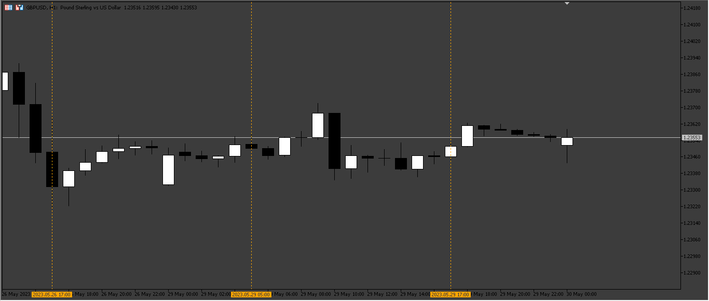
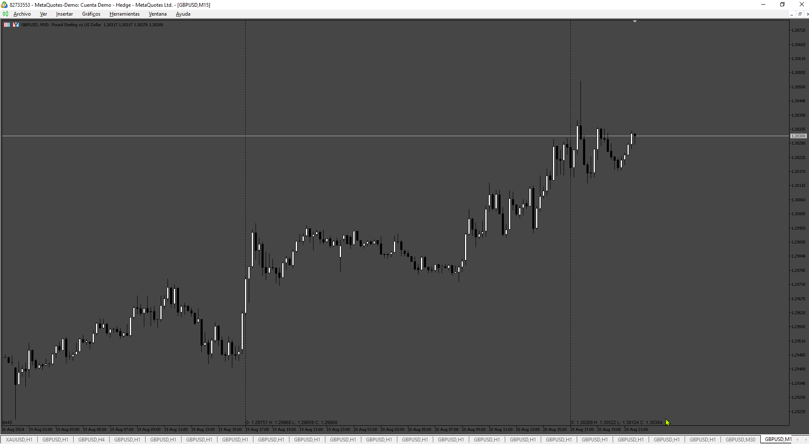

# Custom_Period_Separators

> Source: https://fxcodebase.com/code/viewtopic.php?f=38&t=73795  
> Forum: 38 · Topic 73795 · 8 post(s)

---

## Custom_Period_Separators

**Apprentice** · Sun Jun 04, 2023 3:08 am

Based on the request.
[https://fxcodebase.com/code/viewtopic.php?f=27&p=150955](https://fxcodebase.com/code/viewtopic.php?f=27&p=150955)

 [Custom_Period_Separators.mq5](files/151110/Custom_Period_Separators.mq5)

TS2 version
[https://fxcodebase.com/code/viewtopic.php?f=17&t=73996](https://fxcodebase.com/code/viewtopic.php?f=17&t=73996)

---

## Re: Custom_Period_Separators

**logicgate** · Sun Jun 18, 2023 10:32 am

Beautiful, thanks!

---

## Re: Custom_Period_Separators

**kiraICT** · Sun Jul 30, 2023 8:15 am

can you make this for trade station

---

## Re: Custom_Period_Separators

**Apprentice** · Mon Jul 31, 2023 5:35 pm

We have added your request to the development list.
Development reference 653.

---

## Re: Custom_Period_Separators

**Apprentice** · Thu Aug 03, 2023 7:51 am

TS2 version (My Implementation)
[https://fxcodebase.com/code/viewtopic.php?f=17&t=73996](https://fxcodebase.com/code/viewtopic.php?f=17&t=73996)

---

## Re: Custom_Period_Separators

**rafama007** · Thu Jul 25, 2024 3:44 pm

This indicator is usefull, can you add OHLC line to this Custom_Period_Separators ?

---

## Re: Custom_Period_Separators

**Apprentice** · Thu Jul 25, 2024 3:50 pm

We have added your request to the development list.
Development reference 599

---

## Re: Custom_Period_Separators

**Apprentice** · Sun Aug 25, 2024 4:34 am

 [Custom_Period_Separators.mq5](files/156511/Custom_Period_Separators.mq5)
