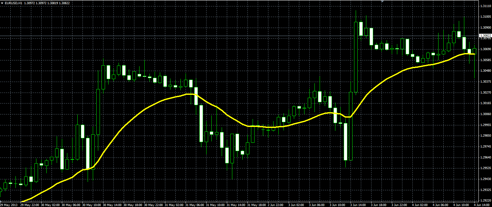

# Custom price MA

> Source: https://fxcodebase.com/code/viewtopic.php?f=38&t=42271  
> Forum: 38 · Topic 42271 · 1 post(s)

---

## Custom price MA

**Alexander.Gettinger** · Thu Jun 27, 2013 11:27 am

The moving average of the custom price ([viewtopic.php?f=38&t=42270](https://fxcodebase.com/code/viewtopic.php?f=38&t=42270)).

Formulas:
Custom price MA = MA(Custom price), where
Custom price = (Coeff_Open*Open+Coeff_High*High+Coeff_Low*Low+Coeff_Close*Close)/Sum_Coeff,
Sum_Coeff = Coeff_Open+Coeff_High+Coeff_Low+Coeff_Close.

 

Download:

 [Custom_Price_MA.mq4](files/68737/Custom_Price_MA.mq4)
