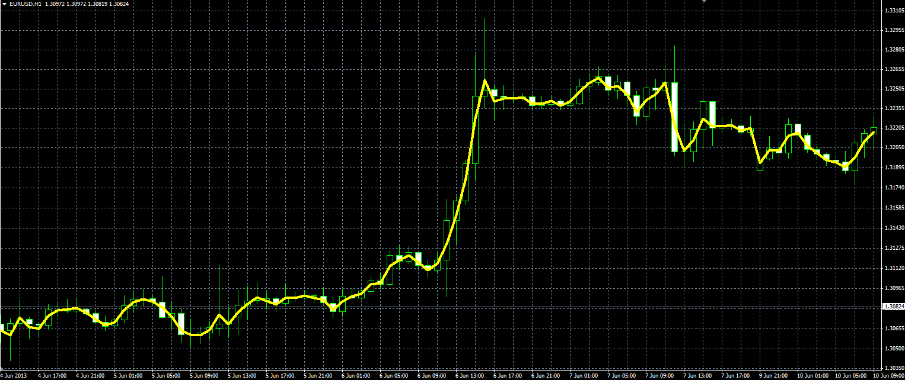

# Custom price

> Source: https://fxcodebase.com/code/viewtopic.php?f=38&t=42270  
> Forum: 38 · Topic 42270 · 2 post(s)

---

## Custom price

**Alexander.Gettinger** · Thu Jun 27, 2013 11:24 am

Formula:
Custom price = (Coeff_Open*Open+Coeff_High*High+Coeff_Low*Low+Coeff_Close*Close)/Sum_Coeff, where
Sum_Coeff = Coeff_Open+Coeff_High+Coeff_Low+Coeff_Close.

 

Download:

 [Custom_Price.mq4](files/68736/Custom_Price.mq4)

---

## Re: Custom price

**Alexander.Gettinger** · Thu Jun 27, 2013 11:27 am

The moving average of the custom price ([viewtopic.php?f=38&t=42271](https://fxcodebase.com/code/viewtopic.php?f=38&t=42271)).
