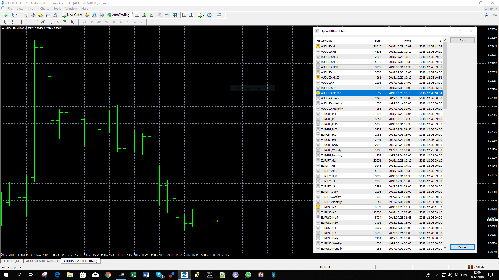

# Custom Time Frame Candle View

> Source: https://fxcodebase.com/code/viewtopic.php?f=38&t=67215  
> Forum: 38 · Topic 67215 · 9 post(s)

---

## Custom Time Frame Candle View

**Apprentice** · Fri Dec 28, 2018 8:03 am

Will only work on the offline chart.
You will have to load the offline data source manually.

 [Custom Time Frame Candle View.mq4](files/123073/Custom%20Time%20Frame%20Candle%20View.mq4)

TS2/Lua version.
[viewtopic.php?f=17&t=60537](https://fxcodebase.com/code/viewtopic.php?f=17&t=60537)

---

## Re: Custom Time Frame Candle View

**logicgate** · Fri Dec 28, 2018 2:00 pm

Excellent!! Cheers!

---

## Re: Custom Time Frame Candle View

**lumanauw** · Thu Apr 04, 2019 8:43 pm

Hi,

I try this Period Converter indicator (MT4), it works fine for past data, but not working live (not drawing any live/forward data). It stops at data where it is put on the first time.

How to make this Indicator also works on live (forward) data?

Thank you

---

## Re: Custom Time Frame Candle View

**TheGMan** · Sun Apr 21, 2019 3:02 pm

> **lumanauw wrote:**
> Hi,
>
> I try this Period Converter indicator (MT4), it works fine for past data, but not working live (not drawing any live/forward data). It stops at data where it is put on the first time.
>
> How to make this Indicator also works on live (forward) data?
>
> Thank you

You need to open the offline chart & use that chart for continual live data. Also, both the main chart you placed the indi on & the offline chart must always be open.

---

## Re: Custom Time Frame Candle View

**Jagg1010** · Thu May 16, 2019 6:08 am

same here - offline chart doesn't update

---

## Re: Custom Time Frame Candle View

**Apprentice** · Fri May 17, 2019 8:02 am

Unfortunately, we can not fix this.
You will have to update your chart manually.

---

## Re: Custom Time Frame Candle View

**TheGMan** · Fri May 17, 2019 3:32 pm

> **Jagg1010 wrote:**
> same here - offline chart doesn't update

Hi Jagg

Use this one attached.

It's an indicator & goes in your MT4 indicators folder. After you have added it to your indicators folder simply refresh your indicators list within your navigator or else just shut down & reopen your platform to compile it. It will then be visible in your indicators list.

Drag it to a chart and within the inputs you will see PeriodMultiplier. So whatever time frame chart you drag it on to you simply add a number in that input to multiply that time frame & that will make your desired time frame.

Example: If you put it on a H1 chart and change the PeriodMultiplier to 8 you will have created an 8-hour chart within your Offline Charts. You open Offline charts & find the pair & the new time frame you just created & open that offline chart.

You can make any desired time frame you wish by simply changing the multiplier number.

You can add your custom indicators to the new chart but you will always need to leave the main chart & the offline chart both open at all times in order for it to continuously update.

Enjoy!

---

## Re: Custom Time Frame Candle View

**Jagg1010** · Mon May 20, 2019 5:14 am

> **TheGMan wrote:**
>
>
> > **Jagg1010 wrote:**
> > same here - offline chart doesn't update
>
>
>
> Hi Jagg
>
> Use this one attached.
>
> It's an indicator & goes in your MT4 indicators folder. After you have added it to your indicators folder simply refresh your indicators list within your navigator or else just shut down & reopen your platform to compile it. It will then be visible in your indicators list.
>
> Drag it to a chart and within the inputs you will see PeriodMultiplier. So whatever time frame chart you drag it on to you simply add a number in that input to multiply that time frame & that will make your desired time frame.
>
> Example: If you put it on a H1 chart and change the PeriodMultiplier to 8 you will have created an 8-hour chart within your Offline Charts. You open Offline charts & find the pair & the new time frame you just created & open that offline chart.
>
> You can make any desired time frame you wish by simply changing the multiplier number.
>
> You can add your custom indicators to the new chart but you will always need to leave the main chart & the offline chart both open at all times in order for it to continuously update.
>
> Enjoy!

Thank - I know that procedure... but wondering why Apprentice indicator doesn't do the "live update" on the offline chart. It must be possible! Can you have a look in your "TimeFrame_Changer" source code how its done there so we can improve Apprentice's indicator here?

---

## Re: Custom Time Frame Candle View

**TheGMan** · Mon May 20, 2019 9:03 am

> **Jagg1010 wrote:**
> Thank - I know that procedure... but wondering why Apprentice indicator doesn't do the "live update" on the offline chart. It must be possible! Can you have a look in your "TimeFrame_Changer" source code how its done there so we can improve Apprentice's indicator here?

Sorry I do not have the MQL4 File.
