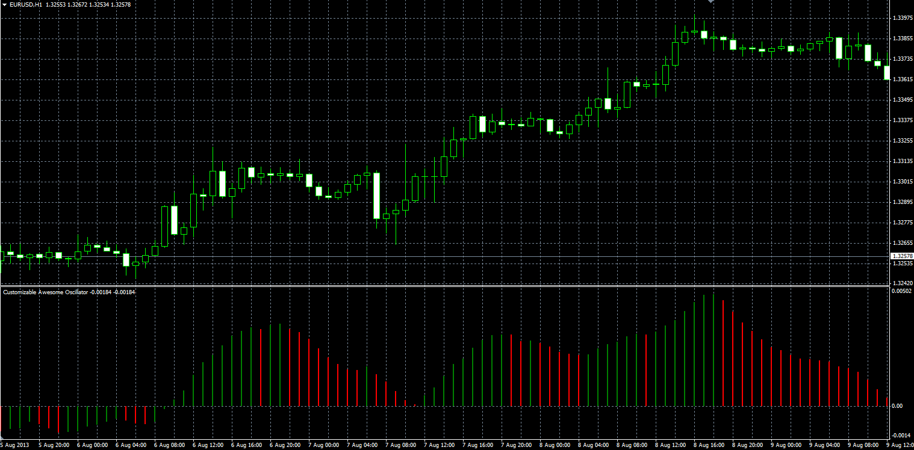

# Customizable Awesome Oscillator

> Source: https://fxcodebase.com/code/viewtopic.php?f=38&t=59127  
> Forum: 38 · Topic 59127 · 1 post(s)

---

## Customizable Awesome Oscillator

**Alexander.Gettinger** · Wed Aug 14, 2013 2:57 pm

Original LUA oscillator: [http://fxcodebase.com/code/viewtopic.php?f=17&t=40068](https://fxcodebase.com/code/viewtopic.php?f=17&t=40068).

Formula:
CAO = MA(Fast_Length, Method, Price)-MA(Slow_Length, Method, Price).

 

Download:

 [Customizable_Awesome_Oscillator.mq4](files/88581/Customizable_Awesome_Oscillator.mq4)
