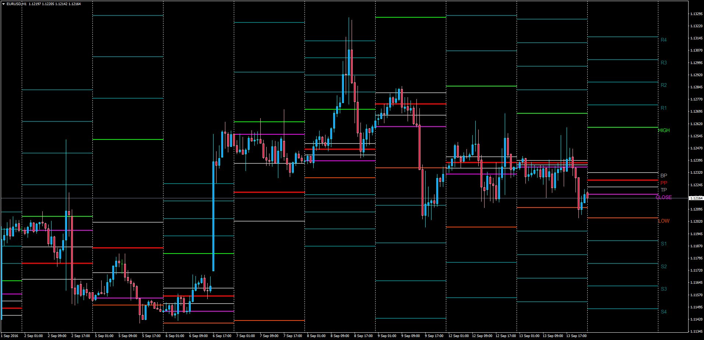
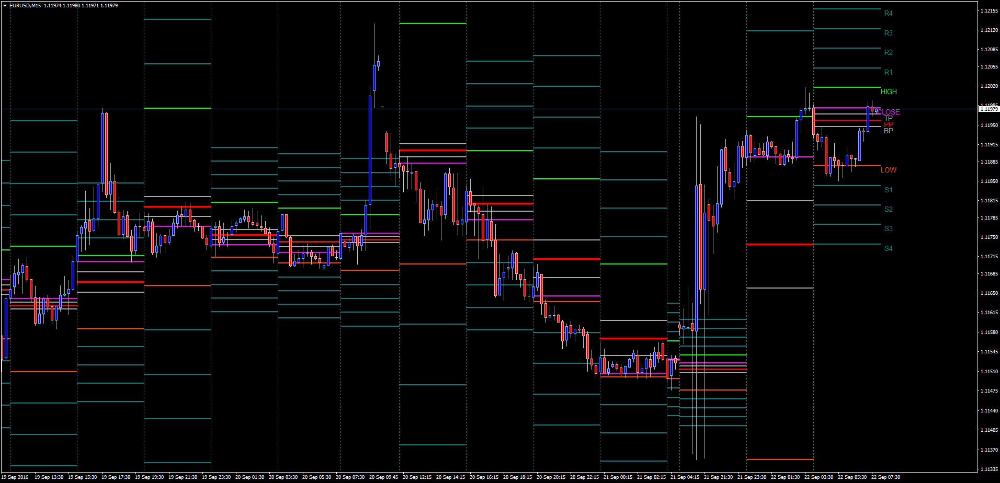

# CustomPivotsExtensions

> Source: https://fxcodebase.com/code/viewtopic.php?f=38&t=63867  
> Forum: 38 · Topic 63867 · 5 post(s)

---

## CustomPivotsExtensions

**Apprentice** · Wed Sep 14, 2016 11:40 am

TS2/Marketscope version.
[viewtopic.php?f=17&t=63492](https://fxcodebase.com/code/viewtopic.php?f=17&t=63492)
A modified version is available here.
[viewtopic.php?f=38&t=64072&p=108969#p108969](https://fxcodebase.com/code/viewtopic.php?f=38&t=64072&p=108969#p108969)
This indicator plots the Pivot Point and else pivots and extensions for the day according to the previous days High, Low and Close values.

It currently works for D1 (daily pivots), but further options can be added.

 [CustomPivotsExtensions.mq4](files/108092/CustomPivotsExtensions.mq4)

 

This is an improvement to the "Custom Pivot Extensions" indicator that plots pivots to daily cycles, this time with the option to select various cycles from 5-min (if seen in a M1 chart) to Monthly cycles.

Available MT4 cycles for pivot extensions: M5, M15, M30, H1, H4, D1, W1, MN1.

Note: The Time Frame where the indicator is plot has to be lower than the selected cycle - otherwise an alert will sound letting you know you need to change the cycle.

Customizable colors and options. Cycles separator (vertical line) included as well.

Picture Example: M15 Chart using M240 Cycles.

 [CustomPivotsExtensions_MultiCycles.mq4](files/108092/CustomPivotsExtensions_MultiCycles.mq4)

---

## Re: CustomPivotsExtensions

**chipsoft** · Sat Sep 17, 2016 1:55 pm

Thanks very much ..You are Great...

Kindly add different time frames for this indicator like: 5m, 15m, 30m, 1h, 4h, D, Week ,Month and Quarter.

Regards

---

## Re: CustomPivotsExtensions

**chipsoft** · Wed Sep 21, 2016 4:47 am

Dear Apprentice,
Kindly add other time frame options for this indicator, such as Quaterly, Monthly, weekly, 4H, 1H, 30 min, 15 min and 5 Min.

Regards

---

## Re: CustomPivotsExtensions

**Apprentice** · Wed Sep 21, 2016 4:55 am

Your request is added to the development list, Under Id Number 3633
 If someone is interested to do this task, please contact me.

---

## Re: CustomPivotsExtensions

**Apprentice** · Thu Sep 22, 2016 3:01 am

CustomPivotsExtensions_MultiCycles.mq4 Added.
