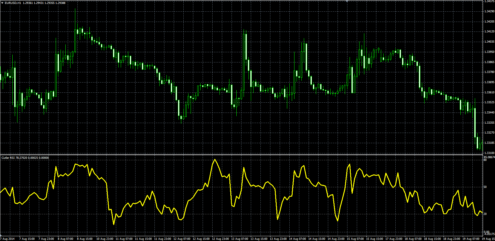

# Cutler's RSI

> Source: https://fxcodebase.com/code/viewtopic.php?f=38&t=61135  
> Forum: 38 · Topic 61135 · 1 post(s)

---

## Cutler's RSI

**Alexander.Gettinger** · Fri Sep 12, 2014 4:48 pm

Original LUA oscillator: [viewtopic.php?f=17&t=59113](https://fxcodebase.com/code/viewtopic.php?f=17&t=59113).

Formulas:
Cutler's RSI = 100-100/(1+P/N), where
P = MA(pos) with [Length] number of periods and [Method] type,
N = MA(neg) with [Length] number of periods and [Method] type,
pos, neg - positive and negative changes of price.

 

Download:

 [Cutler_RSI.mq4](files/95850/Cutler_RSI.mq4)
