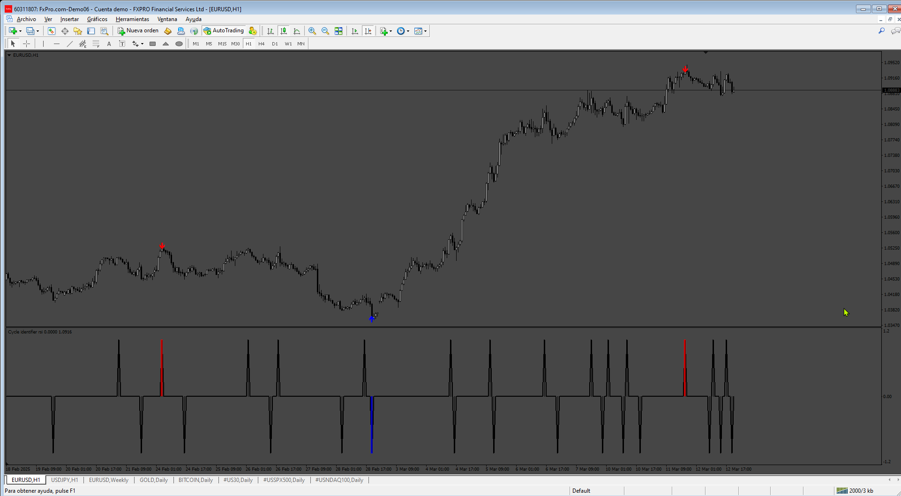
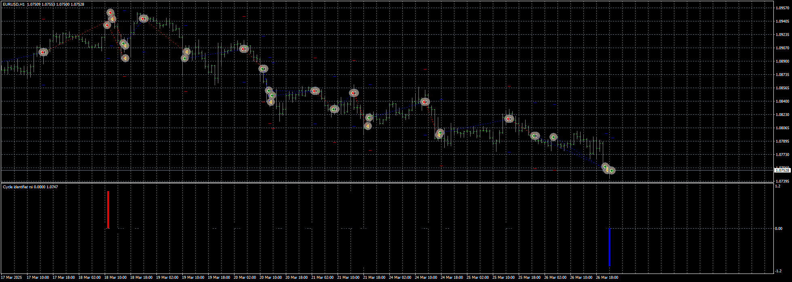

# Cycle identifier rsi

> Source: https://fxcodebase.com/code/viewtopic.php?f=38&t=75723  
> Forum: 38 · Topic 75723 · 4 post(s)

---

## Cycle identifier rsi

**Apprentice** · Sun Mar 16, 2025 2:09 pm

Based on the request.
[https://fxcodebase.com/code/viewtopic.php?f=27&p=158532](https://fxcodebase.com/code/viewtopic.php?f=27&p=158532)

 [Cycle identifier rsi.mq4](files/158640/Cycle%20identifier%20rsi.mq4)

 [Cycle_Identifier_Arrows.mq4](files/158640/Cycle_Identifier_Arrows.mq4)

---

## Re: Cycle identifier rsi

**KUSHI90** · Fri Mar 21, 2025 5:37 am

thanks sir! sir some request sir , can make this EA from this custom indicator ,
1. function EA like TP SL exit buy sell entry
2. lot step Money management base on capital,and max lot by capital exp if capital 100usd max lot 0.10 , EA open by capital only

---

## Re: Cycle identifier rsi

**Apprentice** · Fri Mar 21, 2025 5:51 am

We have added your request to the development list.
Development reference 208

---

## Re: Cycle identifier rsi

**Apprentice** · Wed Mar 26, 2025 3:32 pm

 [CycleIdentifierRSI_EA_v1.00.mq4](files/158791/CycleIdentifierRSI_EA_v1.00.mq4)
