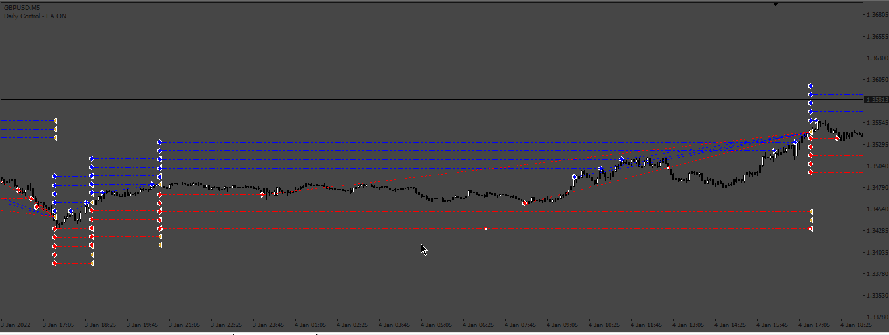

# Cycle_Orders_list

> Source: https://fxcodebase.com/code/viewtopic.php?f=38&t=74395  
> Forum: 38 · Topic 74395 · 5 post(s)

---

## Cycle_Orders_list

**Apprentice** · Thu Nov 30, 2023 2:46 pm

Based on the request.
[https://fxcodebase.com/code/viewtopic.php?f=38&t=74346](https://fxcodebase.com/code/viewtopic.php?f=38&t=74346)

 [Cycle_Orders_list.mq4](files/153510/Cycle_Orders_list.mq4)

---

## Re: Cycle_Orders_list

**xzerax** · Sat Dec 02, 2023 3:00 am

ea only close buy trades when buy trades profit was hit , and sell trades keept opened ,please can you make it calculate profit from all sell and buy opened and if the sum of all of them is profit target than close all and delete pending orders

---

## Re: Cycle_Orders_list

**xzerax** · Sun Dec 03, 2023 12:41 pm

hey Apprentice , thanks its good , but can you make sure that all opend and pending orders close with profit is hit ? because ea close only buy trades because buy profit got hit , make it calculate the value of all sell and buy trades opend to determine profit , and than close all on profit and delete pending orders

---

## Re: Cycle_Orders_list

**Apprentice** · Tue Dec 05, 2023 7:00 am

We have added your request to the development list.
Development reference 1068

---

## Re: Cycle_Orders_list

**Apprentice** · Wed Jan 03, 2024 5:07 am

[Cycle_Orders_list_v2.mq4](files/153903/Cycle_Orders_list_v2.mq4)

Try this version.
