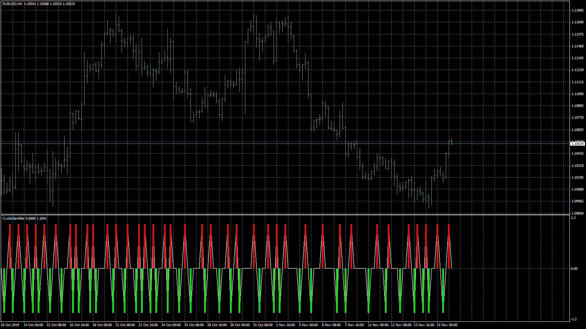
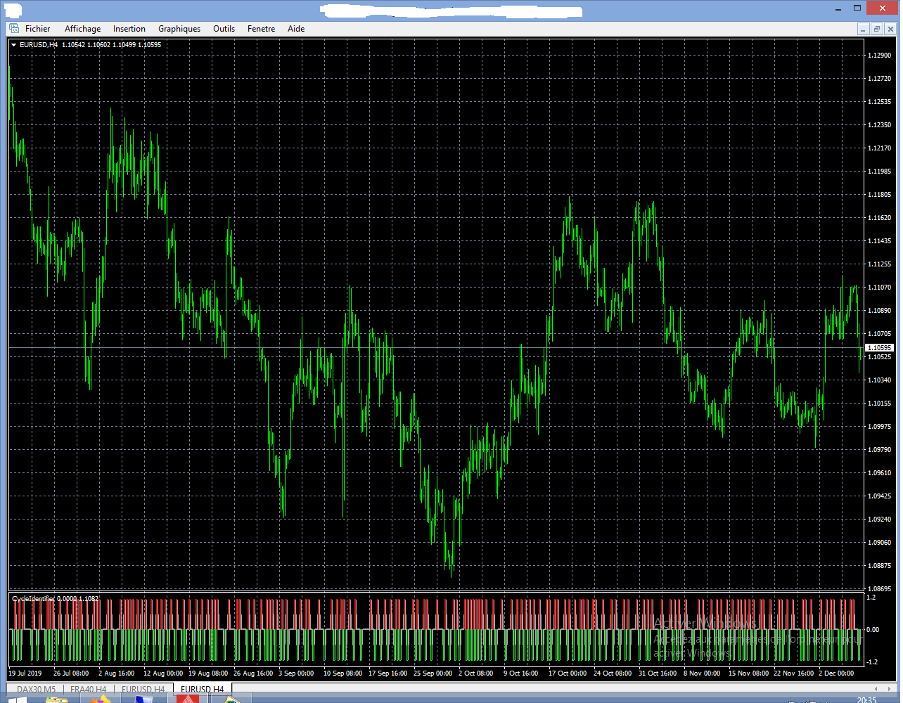
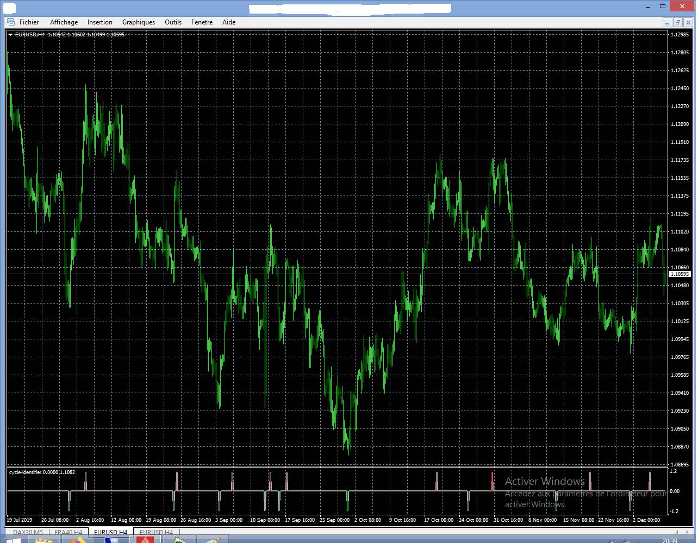
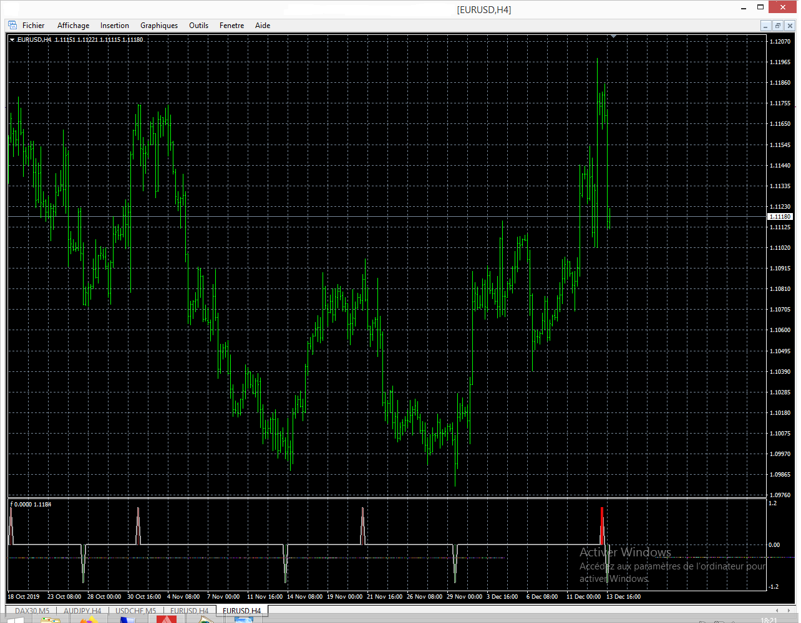

# CycleIdentifier

> Source: https://fxcodebase.com/code/viewtopic.php?f=38&t=69193  
> Forum: 38 · Topic 69193 · 6 post(s)

---

## CycleIdentifier

**Apprentice** · Wed Dec 04, 2019 5:04 pm

Based on request.
[viewtopic.php?f=27&t=69181](https://fxcodebase.com/code/viewtopic.php?f=27&t=69181)

 [CycleIdentifier.mq4](files/130076/CycleIdentifier.mq4)

---

## Re: CycleIdentifier

**nelsen** · Sat Dec 07, 2019 4:34 pm

> **Apprentice wrote:**
>
>
> The attachment **eurusd-h4-forex-capital-markets-4.png** is no longer available
>
>
> Based on request.
> [viewtopic.php?f=27&t=69181](https://fxcodebase.com/code/viewtopic.php?f=27&t=69181)
>
>
> The attachment **eurusd-h4-forex-capital-markets-4.png** is no longer available

HI APPRENTICE
Thanks for the job.
I’ll try the alerts as soon as possible.
but why are there so many signals?

 

 

yet the parameters are the same

---

## Re: CycleIdentifier

**Apprentice** · Tue Dec 10, 2019 9:37 am

[CycleIdentifier.mq4](files/130178/CycleIdentifier.mq4)

Indicator is REALLY poorly written. Any modifications change its calculations.
I have fixed some bugs, but I think the original calculates values not as intended

---

## Re: CycleIdentifier

**nelsen** · Sun Dec 15, 2019 2:15 pm

> **Apprentice wrote:**
>
>
> The attachment **CycleIdentifier.mq4** is no longer available
>
>
> Indicator is REALLY poorly written. Any modifications change its calculations.
> I have fixed some bugs, but I think the original calculates values not as intended

hi Apprentice,
thanks. very much
I found this indicator by chance.
Personally I know nothing about coding but I am interested and watch videos.
I tried something: I took the original code and copy-paste the alert part that you created completely at the end of the original code.

I haven’t tested yet because trading is not my job

it gives this

Code: [Select all](https://fxcodebase.com/code/)
`#property copyright ""
#property link      ""
//----
#property indicator_separate_window
#property indicator_buffers 6
//----
#property indicator_color1 DarkGray
#property indicator_color2 Lime
#property indicator_color3 Red
#property indicator_color4 DarkGreen
#property indicator_color5 Brown
//----
#property indicator_minimum -1.2
#property indicator_maximum 1.2
//----
extern int       PriceActionFilter=1;
extern int       Length=3;
extern int       MajorCycleStrength=4;
extern bool      UseCycleFilter=false;
extern int       UseFilterSMAorRSI=1;
extern int       FilterStrengthSMA=12;
extern int       FilterStrengthRSI=21;
//----
double LineBuffer[];
double MajorCycleBuy[];
double MajorCycleSell[];
double MinorCycleBuy[];
double MinorCycleSell[];
double ZL1[];
//----
double CyclePrice=0.0, Strength =0.0, SweepA=0.0, SweepB=0.0;
int Switch=0, Switch2=0,   SwitchA=0, SwitchB=0, SwitchC=0, SwitchD=0, SwitchE=0, SwitchAA=0, SwitchBB=0;
double Price1BuyA=0.0, Price2BuyA=0.0;
int Price1BuyB=1.0, Price2BuyB=1.0;
double Price1SellA=0.0, Price2SellA=0.0;
int Price1SellB=0.0, Price2SellB=0.0;
bool ActiveSwitch=True, BuySwitchA=FALSE, BuySwitchB=FALSE, SellSwitchA=FALSE, SellSwitchB=FALSE;
int BuySellFac=01;
bool Condition1, Condition2, Condition3, Condition6;
//+------------------------------------------------------------------+
//|                                                                  |
//+------------------------------------------------------------------+
  int init() 
  {
   SetIndexStyle(0,DRAW_LINE,STYLE_SOLID,2);
   SetIndexBuffer(0,LineBuffer);
   SetIndexStyle(1,DRAW_HISTOGRAM,STYLE_SOLID,3);
   SetIndexBuffer(1,MajorCycleBuy);
   SetIndexStyle(2,DRAW_HISTOGRAM,STYLE_SOLID,3);
   SetIndexBuffer(2,MajorCycleSell);
   SetIndexStyle(3,DRAW_HISTOGRAM,STYLE_SOLID,1);
   SetIndexBuffer(3,MinorCycleBuy);
   SetIndexStyle(4,DRAW_HISTOGRAM,STYLE_SOLID,1);
   SetIndexBuffer(4,MinorCycleSell);
   SetIndexStyle(5,DRAW_NONE);
   SetIndexBuffer(5,ZL1);
   SetIndexEmptyValue(1,0.0);
   SetIndexEmptyValue(2,0.0);
   SetIndexEmptyValue(3,0.0);
   SetIndexEmptyValue(4,0.0);
   SetIndexEmptyValue(5,0.0);
   return(0);
  }
//+------------------------------------------------------------------+
//|                                                                  |
//+------------------------------------------------------------------+
int deinit() {return(0);}
//+------------------------------------------------------------------+
//|                                                                  |
//+------------------------------------------------------------------+
  int start()
  {
   int counted_bars=IndicatorCounted();
   if(counted_bars<0) return(-1);
   // if(counted_bars>0) counted_bars--;
   // int position=Bars-1;
   int position=Bars-counted_bars;
   if (position<0) position=0;
//----
   int rnglength=250;
   double range=0.0, srange=0.0;
   for(int pos=position; pos >=0; pos--)
     {
      srange=0.0;
      int j=0;
      for(int i=0;i<rnglength;i++)
        {
         j++;
         int posr=pos + i;
         if (posr>=Bars)
            break;
         srange=srange + (High[posr] - Low[posr]);
        }
      range=srange/j * Length;
      int BarNumber=Bars-pos; //??????????
      if (BarNumber < 0)
         BarNumber=0;
      CyclePrice=iMA(NULL, 0, PriceActionFilter, 0, MODE_SMMA, PRICE_CLOSE, pos);
      if (UseFilterSMAorRSI==1)
         ZL1[pos]=ZeroLag(CyclePrice,FilterStrengthSMA, pos);
      if (UseFilterSMAorRSI==2)
         ZL1[pos]=ZeroLag( iRSI(NULL, 0, 14, CyclePrice, FilterStrengthRSI ), FilterStrengthRSI, pos);
      if (ZL1[pos] > ZL1[pos+1])
         SwitchC=1;
      if (ZL1[pos] < ZL1[pos+1])
         SwitchC=2;
      if (BarNumber<=1)
        {
         if (Strength==0)
            SweepA =range;
         else
            SweepA=Strength;
         Price1BuyA =CyclePrice;
         Price1SellA =CyclePrice;
        }
      /* ***************************************************************** */
      if (BarNumber > 1)
        {
         if (Switch > -1)
           {
            if (CyclePrice < Price1BuyA)
              {
               if (UseCycleFilter && (SwitchC==2) && BuySwitchA )
                 {
                  MinorCycleBuy[pos + BarNumber - Price1BuyB]=0; //MinorBuySell
                  LineBuffer[pos + BarNumber - Price1BuyB ]=0; //line
                 }
               if (!UseCycleFilter && BuySwitchA)
                 {
                  MinorCycleBuy[pos +BarNumber - Price1BuyB]=0;
                  LineBuffer[pos +BarNumber - Price1BuyB]=0;
                 }
               Price1BuyA=CyclePrice;
               Price1BuyB=BarNumber;
               BuySwitchA=TRUE;
              }
            else if (CyclePrice > Price1BuyA)
                 {
                  SwitchA=BarNumber - Price1BuyB;
                  if (!UseCycleFilter)
                    {
                     MinorCycleBuy[pos +SwitchA]=-1;//MinorBuySell - DarkGreen
                     LineBuffer[pos +SwitchA]=-1;//line
                    }
                  if (UseCycleFilter && SwitchC ==1)
                    {
                     MinorCycleBuy[pos +SwitchA]=-1;  //MinorBuySell
                     LineBuffer[pos +SwitchA]=-1; //line
                     SwitchD=1;
                    }
                  else
                    {
                     SwitchD=0;
                    }
                  BuySwitchA=TRUE;
                  double cyclePrice1=iMA(NULL, 0, PriceActionFilter, 0, MODE_SMMA, PRICE_CLOSE, pos + SwitchA);
                  if (ActiveSwitch)
                    {
                     Condition1=CyclePrice - cyclePrice1>=SweepA;
                    }
                  else
                    {
                     Condition1=CyclePrice>=cyclePrice1 * (1 + SweepA/1000);
                    }
                  if (Condition1 && SwitchA>=BuySellFac)
                    {
                     Switch= - 1;
                     Price1SellA=CyclePrice;
                     Price1SellB=BarNumber;
                     SellSwitchA=FALSE;
                     BuySwitchA=FALSE;
                    }
                 }
           }
         if(Switch < 1)
           {
            if (CyclePrice > Price1SellA)
              {
               if (UseCycleFilter && SwitchC==1 && SellSwitchA )
                 {
                  MinorCycleSell[pos +BarNumber - Price1SellB]=0; //MinorBuySell
                  LineBuffer[pos +BarNumber - Price1SellB ]=0; //line
                 }
               if (!UseCycleFilter && SellSwitchA )
                 {
                  MinorCycleSell[pos +BarNumber - Price1SellB]=0;//MinorBuySell
                  LineBuffer[pos +BarNumber - Price1SellB]=0;//line
                 }
               Price1SellA=CyclePrice;
               Price1SellB=BarNumber;
               SellSwitchA=TRUE;
              }
            else if (CyclePrice < Price1SellA)
                 {
                  SwitchA=BarNumber - Price1SellB;
                  if (!UseCycleFilter)
                    {
                     MinorCycleSell[pos +SwitchA]=1; // MinorBuySell darkRed
                     LineBuffer[pos +SwitchA]=1; //"CycleLine"
                    }
                  if (UseCycleFilter && (SwitchC==2))
                    {
                     MinorCycleSell[pos +SwitchA]=1;//MinorBuySell darkRed
                     LineBuffer[pos +SwitchA]=1;//CycleLine
                     SwitchD =2;
                    }
                  else
                     SwitchD =0;
                  SellSwitchA=TRUE;
                  double cyclePrice2=iMA(NULL, 0, PriceActionFilter, 0, MODE_SMMA, PRICE_CLOSE, pos + SwitchA);
                  if (ActiveSwitch)
                     Condition1=(cyclePrice2 - CyclePrice)>=SweepA;
                  else
                     Condition1=CyclePrice<=(cyclePrice2 * (1 - SweepA/1000));
                  if (Condition1 && SwitchA>=BuySellFac)
                    {
                     Switch=1;
                     Price1BuyA=CyclePrice;
                     Price1BuyB=BarNumber;
                     SellSwitchA=FALSE;
                     BuySwitchA=FALSE;
                    }
                 }
             }
         }
      LineBuffer[pos]=0;
      MinorCycleBuy[pos]=0;
      MinorCycleSell[pos]=0;
//----
      if (BarNumber==1)
        {
         if (Strength==0)
            SweepB =range *  MajorCycleStrength;
         else
            SweepB=Strength * MajorCycleStrength;
         Price2BuyA=CyclePrice;
         Price2SellA=CyclePrice;
        }
      if (BarNumber > 1)
        {
         if (Switch2  >  - 1)
           {
            if (CyclePrice < Price2BuyA)
              {
               if (UseCycleFilter && SwitchC==2 && BuySwitchB )
                 {
                  MajorCycleBuy [pos +BarNumber - Price2BuyB]=0; //MajorBuySell,green
                  //            LineBuffer[pos + BarNumber - Price2BuyB ] = 0; //line -----
                 }
               if (!UseCycleFilter && BuySwitchB )
                 {
                  MajorCycleBuy [pos +BarNumber - Price2BuyB]=0;//MajorBuySell,green
                  //               LineBuffer[pos + BarNumber - Price2BuyB ] = 0; //line-----------
                 }
               Price2BuyA=CyclePrice;
               Price2BuyB=BarNumber;
               BuySwitchB=TRUE;
              }
            else if (CyclePrice > Price2BuyA)
                 {
                  SwitchB=BarNumber - Price2BuyB;
                  if (!UseCycleFilter)
                    {
                     MajorCycleBuy [pos +SwitchB]=-1; //MajorBuySell green
                     //               LineBuffer[pos + SwitchB] = -1; //line--------------
                    }
                  if (UseCycleFilter && SwitchC ==1)
                    {
                     MajorCycleBuy [pos +SwitchB]=-1; //MajorBuySell green
                     //             LineBuffer[pos + SwitchB] = -1; //line-----------------
                     SwitchE =1;
                    }
                  else
                     SwitchE =0;
                  BuySwitchB=TRUE;
                  double cyclePrice3=iMA(NULL, 0, PriceActionFilter, 0, MODE_SMMA, PRICE_CLOSE, pos + SwitchB);
                  if (ActiveSwitch)
                     Condition6=CyclePrice - cyclePrice3>=SweepB;
                  else
                     Condition6=CyclePrice>=cyclePrice3 * (1 + SweepB/1000);
                  if (Condition6 && SwitchB>=BuySellFac)
                    {
                     Switch2= - 1;
                     Price2SellA=CyclePrice;
                     Price2SellB=BarNumber;
                     SellSwitchB=FALSE;
                     BuySwitchB=FALSE;
                    }
                 }
             }
         if (Switch2  < 1)
           {
            if (CyclePrice  > Price2SellA )
              {
               if (UseCycleFilter && SwitchC ==1 && SellSwitchB )
                 {
                  MajorCycleSell [pos +BarNumber - Price2SellB]=0; //"MajorBuySell",red
                  //               LineBuffer[pos + BarNumber - Price2SellB ] = 0; //line -----
                 }
               if (!UseCycleFilter && SellSwitchB )
                 {
                  MajorCycleSell [pos +BarNumber - Price2SellB]=0;//"MajorBuySell",red
                  //              LineBuffer[pos + BarNumber - Price2SellB ] = 0; //line -----
                 }
               Price2SellA=CyclePrice;
               Price2SellB=BarNumber;
               SellSwitchB=TRUE;
              }
            else if (CyclePrice < Price2SellA)
                 {
                  SwitchB=BarNumber - Price2SellB ;
                  if (!UseCycleFilter)
                    {
                     MajorCycleSell[pos + SwitchB]=1; //"MajorBuySell",red
                     //             LineBuffer[pos + SwitchB ] = 1; //line -----
                    }
                  if (UseCycleFilter && SwitchC ==2)
                    {
                     MajorCycleSell [pos + SwitchB]=1; //"MajorBuySell",red
                     //            LineBuffer[pos + SwitchB ] = 1; //line -----
                     SwitchE =2;
                    }
                  else
                     SwitchE =0;
                  SellSwitchB=TRUE;
                  double cyclePrice4=iMA(NULL, 0, PriceActionFilter, 0, MODE_SMMA, PRICE_CLOSE, pos + SwitchB);
                  if (ActiveSwitch)
                     Condition6=cyclePrice4 - CyclePrice>=SweepB;
                  else
                     Condition6=CyclePrice<=cyclePrice4 * (1.0 - SweepB/1000.0);
                  if (Condition6 && SwitchB>=BuySellFac)
                    {
                     Switch2=1;
                     Price2BuyA=CyclePrice;
                     Price2BuyB=BarNumber;
                     SellSwitchB=FALSE;
                     BuySwitchB=FALSE;
                    }
                 }
             }
         }
      LineBuffer[pos]=0;
      MajorCycleSell[pos]=0;
      MajorCycleBuy[pos]=0;
     }
   return(0);
  }
//+------------------------------------------------------------------+
//|                                                                  |
//+------------------------------------------------------------------+
double ZeroLag(double price, int length, int pos)
  {
   if (length < 3)
     {
      return(price);
     }
   double aa=MathExp(-1.414*3.14159/length);
   double bb=2*aa*MathCos(1.414*180/length);
   double CB=bb;
   double CC=-aa*aa;
   double CA=1 - CB - CC;
   double CD=CA*price + CB*ZL1[pos+1] + CC*ZL1[pos+2];
   return(CD);
  }
//Signaler v 1.7
// More templates and snippets on https://github.com/sibvic/mq4-templates
input string   AlertsSection            = ""; // == Alerts ==
input bool     popup_alert              = false; // Popup message
input bool     notification_alert       = false; // Push notification
input bool     email_alert              = false; // Email
input bool     play_sound               = false; // Play sound on alert
input string   sound_file               = ""; // Sound file
input bool     start_program            = false; // Start inputal program
input string   program_path             = ""; // Path to the inputal program executable
input bool     advanced_alert           = false; // Advanced alert (Telegram/Discord/other platform (like another MT4))
input string   advanced_key             = ""; // Advanced alert key
input string   Comment2                 = "- You can get a key via @profit_robots_bot Telegram Bot. Visit ProfitRobots.com for discord/other platform keys -";
input string   Comment3                 = "- Allow use of dll in the indicator parameters window -";
input string   Comment4                 = "- Install AdvancedNotificationsLib.dll -";

// AdvancedNotificationsLib.dll could be downloaded here: http://profitrobots.com/Home/TelegramNotificationsMT4
#import "AdvancedNotificationsLib.dll"
void AdvancedAlert(string key, string text, string instrument, string timeframe);
#import
#import "shell32.dll"
int ShellExecuteW(int hwnd,string Operation,string File,string Parameters,string Directory,int ShowCmd);
#import

class Signaler
{
   string _symbol;
   ENUM_TIMEFRAMES _timeframe;
   string _prefix;
public:
   Signaler(const string symbol, ENUM_TIMEFRAMES timeframe)
   {
      _symbol = symbol;
      _timeframe = timeframe;
   }

   void SetMessagePrefix(string prefix)
   {
      _prefix = prefix;
   }

   string GetSymbol()
   {
      return _symbol;
   }

   ENUM_TIMEFRAMES GetTimeframe()
   {
      return _timeframe;
   }

   string GetTimeframeStr()
   {
      switch (_timeframe)
      {
         case PERIOD_M1: return "M1";
         case PERIOD_M5: return "M5";
         case PERIOD_D1: return "D1";
         case PERIOD_H1: return "H1";
         case PERIOD_H4: return "H4";
         case PERIOD_M15: return "M15";
         case PERIOD_M30: return "M30";
         case PERIOD_MN1: return "MN1";
         case PERIOD_W1: return "W1";
      }
      return "M1";
   }

   void SendNotifications(const string subject, string message = NULL, string symbol = NULL, string timeframe = NULL)
   {
      if (message == NULL)
         message = subject;
      if (_prefix != "" && _prefix != NULL)
         message = _prefix + message;
      if (symbol == NULL)
         symbol = _symbol;
      if (timeframe == NULL)
         timeframe = GetTimeframeStr();

      if (start_program)
         ShellExecuteW(0, "open", program_path, "", "", 1);
      if (popup_alert)
         Alert(message);
      if (email_alert)
         SendMail(subject, message);
      if (play_sound)
         PlaySound(sound_file);
      if (notification_alert)
         SendNotification(message);
      if (advanced_alert && advanced_key != "" && !IsTesting())
         AdvancedAlert(advanced_key, message, symbol, timeframe);
   }
};
Signaler* signaler;
//+------------------------------------------------------------------+`
//| |

 

---

## Re: CycleIdentifier

**sydneygithinji** · Mon Mar 23, 2020 4:24 pm

Best indicator ever when looking at the bigger picture in relation to market cycles

---

## Re: CycleIdentifier

**AfsalMe** · Thu Apr 09, 2020 5:55 am

Good in higher timeframes above H1. Please note that this indicator repaints. So be careful.
