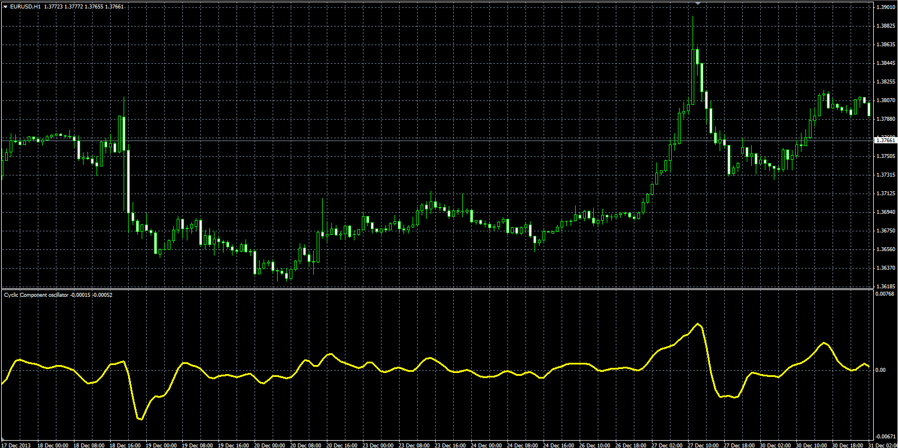
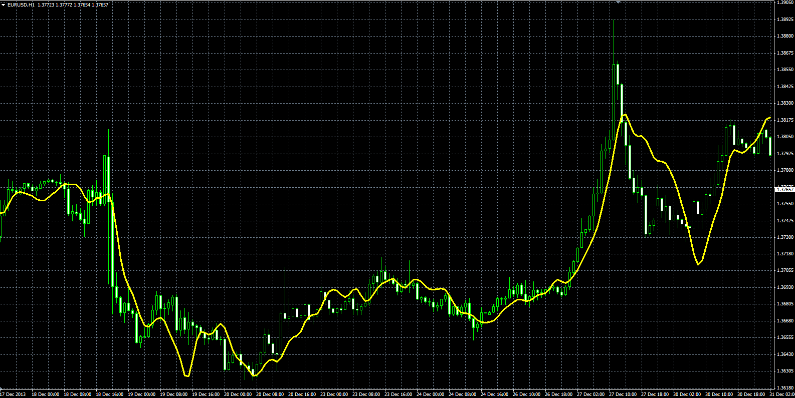
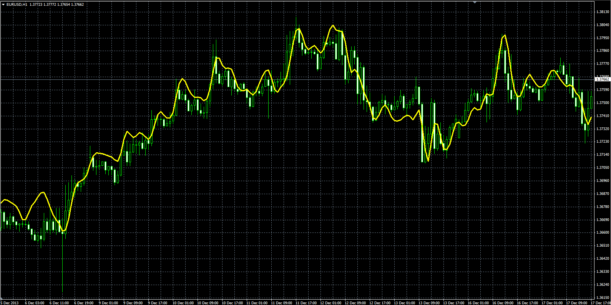

# Cyclic Component

> Source: https://fxcodebase.com/code/viewtopic.php?f=38&t=60403  
> Forum: 38 · Topic 60403 · 1 post(s)

---

## Cyclic Component

**Alexander.Gettinger** · Wed Mar 05, 2014 5:00 pm

Original LUA indicators: [viewtopic.php?f=17&t=60180](https://fxcodebase.com/code/viewtopic.php?f=17&t=60180).

**Cyclic Component:**

Formulas:
Cyclic Component [i] = (HP[i]+2*HP[i-1]+2*HP[i-2]+HP[i-3])/6, where
HP[i] = (Price[i]-Price[i-1])*(1+Alpha)/2+2*Alpha*HP[i-1],
Alpha = (1-sin(2*Pi/Length))/cos(2*Pi/Length).

 

Download:

 [CC.mq4](files/93039/CC.mq4)

**Instantaneous Trendline:**

Formulas:
Instantaneous Trendline = MVA(Price, Length)+SmoothSlope/2, where
SmoothSlope[i] = (Slope[i]+2*Slope[i-1]+2*Slope[i-2]+Slope[i-3])/6,
Slope[i] = Price[i]-Price[i-Length+1].

 

Download:

 [IT.mq4](files/93039/IT.mq4)

**Modeling the market:**

Formula:
Modeling the market = Instantaneous Trendline+Cyclic Component.

 

Download:

 [Modeling_The_Market.mq4](files/93039/Modeling_The_Market.mq4)
