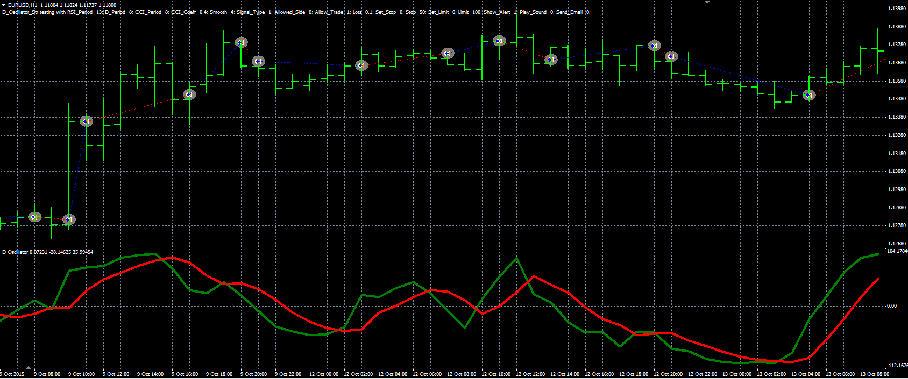

# D oscillator strategy

> Source: https://fxcodebase.com/code/viewtopic.php?f=38&t=63291  
> Forum: 38 · Topic 63291 · 1 post(s)

---

## D oscillator strategy

**Alexander.Gettinger** · Thu Mar 24, 2016 1:14 pm

The strategy based on D oscillator ([viewtopic.php?f=38&t=20672](https://fxcodebase.com/code/viewtopic.php?f=38&t=20672)).

Buy condition: the green line crosses above the red line.
Sell condition: the green line crosses under the red line.

 

Download:

 [D_Oscillator_Str.mq4](files/105445/D_Oscillator_Str.mq4)

D oscillator ([viewtopic.php?f=38&t=20672](https://fxcodebase.com/code/viewtopic.php?f=38&t=20672)) should be installed for correct work.
