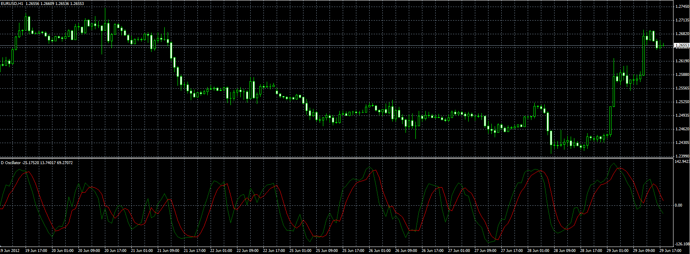

# D oscillator

> Source: https://fxcodebase.com/code/viewtopic.php?f=38&t=20672  
> Forum: 38 · Topic 20672 · 2 post(s)

---

## D oscillator

**Alexander.Gettinger** · Fri Jun 29, 2012 1:28 pm

Original indicator: [viewtopic.php?f=17&t=3608](https://fxcodebase.com/code/viewtopic.php?f=17&t=3608)

> Oscillator based on two indicators: RSI and CCI.
>
> Formulas:
> Line1[i]=2/(Smooth+1)*StCCI+(1-2/(Smooth+1))*Line1[i-1],
> Line2[i]=2/(Smooth*0.8+1)*Line1[i-1]+(1-2/(Smooth*0.8+1))*Line2[i-1], where
> StCCI=[CCI_Coeff]*CCI[i]+(1-[CCI_Coeff])*StRSI,
> StRSI=(RSI[i]-MinRSI)*200/(MaxRSI-MinRSI)-100,
> MaxRSI, MinRSI is a maximum and minimum of RSI from [i-D_Period] to [i].

 

Download:

 [D_Oscillator.mq4](files/36246/D_Oscillator.mq4)

---

## D oscillator

**Kabanga** · Wed Jul 11, 2012 7:56 pm

I could use copies or originals of the manuals for the late model 210 Audio Oscillator, 10cy-100kc version with 6au6 osc. and the matching 410 Distortion Analyser.
Thanks,
Bill, KB3DKS
