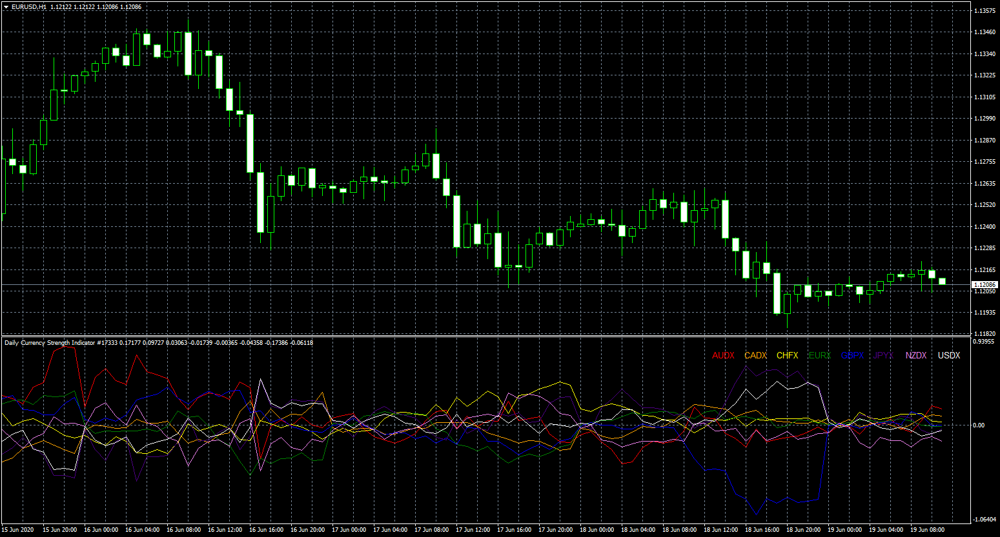

# Daily_Currency_Strength_Indicator

> Source: https://fxcodebase.com/code/viewtopic.php?f=38&t=70043  
> Forum: 38 · Topic 70043 · 9 post(s)

---

## Daily_Currency_Strength_Indicator

**Apprentice** · Fri Jun 19, 2020 4:52 am

Based on request.
[viewtopic.php?f=27&t=69946](https://fxcodebase.com/code/viewtopic.php?f=27&t=69946)

 [Daily_Currency_Strength_Indicator.mq4](files/135103/Daily_Currency_Strength_Indicator.mq4)

 [Daily_Currency_Strength_Indicator+alert.mq4](files/135103/Daily_Currency_Strength_Indicatoralert.mq4)

---

## Re: Daily_Currency_Strength_Indicator

**naluvs01** · Wed Dec 21, 2022 9:26 pm

Please, Please...can alerts be added to this indicator, mainly push notifications.

I'd be eternally grateful!

---

## Re: Daily_Currency_Strength_Indicator

**Apprentice** · Thu Dec 22, 2022 9:29 am

We have added your request to the development list.
Development reference 844.

---

## Re: Daily_Currency_Strength_Indicator

**Apprentice** · Tue Jan 17, 2023 7:50 am

Daily_Currency_Strength_Indicator+alert added.

---

## Re: Daily_Currency_Strength_Indicator

**naluvs01** · Sun Jun 11, 2023 12:07 am

Hi Apprentice,

I want to thank you again for adding the crossover alerts to this great indicator. I have one more request, if possible. Can an alert option be added when currencies cross the zero level either up or down and an option to turn off crossover alerts (or an option for crossover or level cross)? It would make this indicator absolutely PERFECT!

Thank you in advance for your consideration!!!!!

---

## Re: Daily_Currency_Strength_Indicator

**Apprentice** · Thu Jun 15, 2023 5:32 am

We have added your request to the development list.
Development reference 530.

---

## Re: Daily_Currency_Strength_Indicator

**Apprentice** · Tue Jun 20, 2023 1:18 pm

[Daily_Currency_Strength_Indicator+alert.mq4](files/151323/Daily_Currency_Strength_Indicatoralert.mq4)

Try this version.

---

## Re: Daily_Currency_Strength_Indicator

**naluvs01** · Tue Jun 20, 2023 9:26 pm

Mr Apprentice,

You are a Godsend...Thank you!!!!!

---

## Re: Daily_Currency_Strength_Indicator

**sumolo** · Tue Jul 25, 2023 9:30 pm

Please MT5 version? thank you
