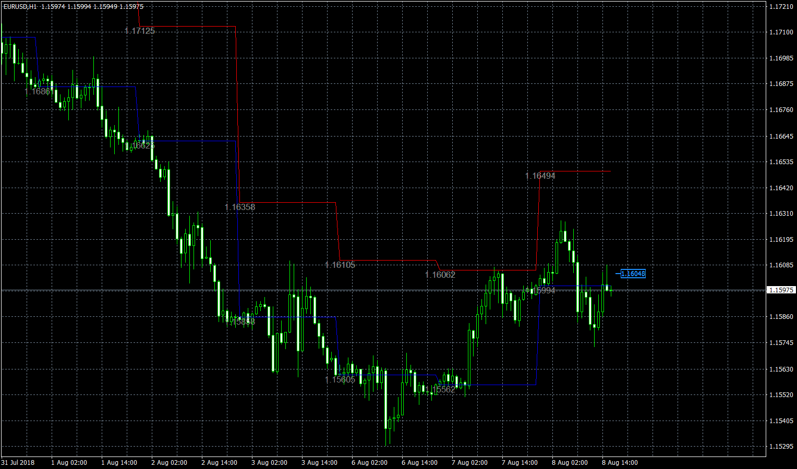

# Daily_Open

> Source: https://fxcodebase.com/code/viewtopic.php?f=38&t=66594  
> Forum: 38 · Topic 66594 · 4 post(s)

---

## Daily_Open

**Apprentice** · Thu Aug 23, 2018 4:37 am

TS2/Lua version.
[viewtopic.php?f=17&t=66134](https://fxcodebase.com/code/viewtopic.php?f=17&t=66134)

 [Daily_Open.mq4](files/120756/Daily_Open.mq4)

---

## Re: Daily_Open

**easytrading** · Mon Nov 22, 2021 5:48 pm

Hello Apprentice,

If you please, to code an MT4 EA based on this Daily_open line indicator to open a position each time the price cross 5 pips above or below the Daily open price line as below:

Buy above 5 pips from the Daily price line.
Sell below 5 pips from the Daily price line.

and if the price returned on the opposite direction by 5 pips from Daily open after opening a position, first close the previous position and then open immediately another position in that direction. so that to keep only one position opened.and when hitting the target restart the EA when the same conditions met again ( when the price cross 5 pips above or below the Daily open line for the same day.
and to close the open position in the end of the Day . and reopen new position according to the new Daily open line .

using these user parameters:

position lot size: ....lots
first T/p : .... pips
second T/P : .... pips

Thank you with my highly appreciation.

---

## Re: Daily_Open

**Apprentice** · Thu Nov 25, 2021 3:40 am

Your request is added to the development list.
Development reference 999.

---

## Re: Daily_Open

**Apprentice** · Mon Dec 06, 2021 12:05 pm

Try this version.
[https://fxcodebase.com/code/viewtopic.php?f=38&t=71697](https://fxcodebase.com/code/viewtopic.php?f=38&t=71697)
