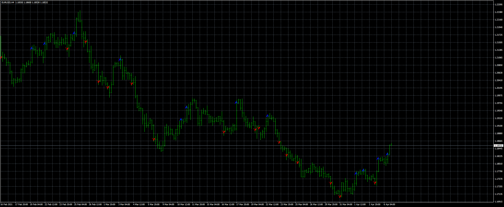

# Daily_range_breakout

> Source: https://fxcodebase.com/code/viewtopic.php?f=38&t=71342  
> Forum: 38 · Topic 71342 · 3 post(s)

---

## Daily_range_breakout

**Apprentice** · Mon Jul 12, 2021 1:08 pm

TS2 version.
[https://fxcodebase.com/code/viewtopic.php?f=17&t=71334](https://fxcodebase.com/code/viewtopic.php?f=17&t=71334)

 [Daily_range_breakout.mq4](files/142794/Daily_range_breakout.mq4)

---

## Re: Daily_range_breakout

**Honest_Trader** · Tue Jul 13, 2021 9:33 am

Thanks mate, will check. However when I dragged this to the chart, see no lines of any sort marking the low or high of the previous day. Is this how it behaves ?

Also attaching Notification dll for everyone's use, as I see it is one of the dependencies.

Warm Regards
GK

---

## Re: Daily_range_breakout

**Honest_Trader** · Tue Jul 13, 2021 9:35 am

Notification dll.
