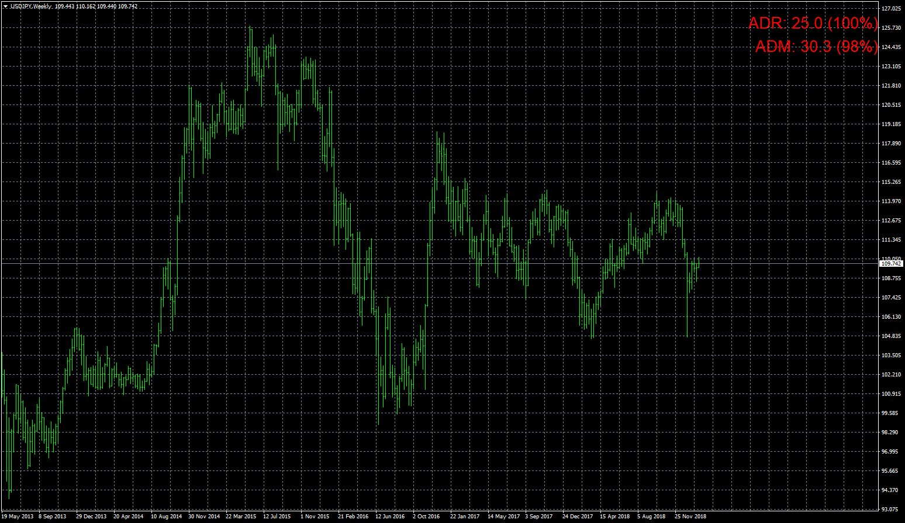

# Daily Range Movement Summary

> Source: https://fxcodebase.com/code/viewtopic.php?f=38&t=67334  
> Forum: 38 · Topic 67334 · 50 post(s)

---

## Daily Range Movement Summary

**Apprentice** · Sat Feb 09, 2019 5:10 am

Based on request.
[viewtopic.php?f=27&t=67289](https://fxcodebase.com/code/viewtopic.php?f=27&t=67289)

 [Daily Range Movement Summary.mq4](files/123803/Daily%20Range%20Movement%20Summary.mq4)

TS2/Lua version
[viewtopic.php?f=17&t=70109](https://fxcodebase.com/code/viewtopic.php?f=17&t=70109)

---

## Re: Daily Range Movement Summary

**logicgate** · Sat Feb 09, 2019 7:53 am

Thanks a lot my friend! I am gonna download and test. Looking good!

I can see you are using the indicator in a weekly timeframe. That is why I asked you to make a version for weekly and other for monthly.

Because:

1st - you won`t get confused (because in your pic, we are seeing daily summary in the weekly chart)

2nd - the calculation method must be optimized for weekly and monthly. Because the indicator uses the daily bars for calculate the ADR, right? So, the average weekly range (AWR) will use the weekly bars, and the average monthly range (AMR) will use the monthly bars.

---

## Re: Daily Range Movement Summary

**logicgate** · Sat Feb 09, 2019 8:15 am

Another thing I noticed in your image, you are using a JPY cross, I can see you broker uses fractional pip. Usually there are only two decimals to the right, like mine.

The reading in your screen says 25.0 for ADR and 30.3 for ADM.

this means 250 and 303 pips right? If you could get rid of the dot it would be better.

---

## Re: Daily Range Movement Summary

**Apprentice** · Mon Feb 11, 2019 4:42 am

Your request is added to the development list under Id Number 4466

---

## Re: Daily Range Movement Summary

**Apprentice** · Wed Feb 13, 2019 5:23 am

[Daily Range Movement Summary v.1.1.mq4](files/123867/Daily%20Range%20Movement%20Summary%20v.1.1.mq4)

Try this version.

---

## Re: Daily Range Movement Summary

**logicgate** · Sun Aug 18, 2019 6:25 pm

Hello dear friend, I was testing the indis now, there is need for more tweaking.

There is conflicting info, even though the indis are set with the same settings, check the screenshot.

The daily range movement summary is in need of the timeframe option too (in indi settings), just like the ADR.

Perhaps they are not using the same start time for the calculation. My broker is IC Markets so the daily bars are synced to the NY close. So at 17h in NY it is 00:00 in my broker (GMT +3) and a new daily bar starts plotting. So make sure that the calculation is using the open of the daily bar as a start point Thanks!.

 [Average Daily Range.mq4](files/128011/Average%20Daily%20Range.mq4)

---

## Re: Daily Range Movement Summary

**Apprentice** · Fri Aug 23, 2019 5:40 am

[Daily Range Movement Summary v.1.2.mq4](files/128154/Daily%20Range%20Movement%20Summary%20v.1.2.mq4)

Try this version.

---

## Re: Daily Range Movement Summary

**logicgate** · Fri Aug 23, 2019 8:40 am

Great!!

---

## Re: Daily Range Movement Summary

**logicgate** · Fri Aug 23, 2019 12:32 pm

I have just tested and I can see you haven´t added the MTF ability to the indicator as requested and shown in the screenshot I posted. The ADR matches now with the other ADR, **but the ADM is still changing when we change the timeframes**, that is we need to have the MTF option. If I set to daily for example, like in the ADR indicator, then it does not matter if I change the timeframes, the value is constant.

Best regards!

---

## Re: Daily Range Movement Summary

**Apprentice** · Tue Aug 27, 2019 7:23 am

Your request is added to the development list.
 Internal developer reference 7.

---

## Re: Daily Range Movement Summary

**logicgate** · Tue Aug 27, 2019 6:10 pm

Thanks my friend. It needs also another small tweaking. I was testing the indicator today, it is working almost perfectly with the exception of oscillation of values during the day. I took some screenshots for you to see. First I was testing in the simulator, but I noticed that it was not working properly, but it is because the indicator does not work in the backtester, not because it does not work, unfortunately can´t test it in backtester. On the simulation the day never resets, the indicator "thinks" it is always the same day. So I left it running on a live chart and I could see it resets properly.

What I noticed during the day is that the ADR and ADM values keep oscillating some pips up and down. I think it is because the code is considering the current bar in the calculation, you must exclude the current bar from the calculation. If ADR and ADM are set to 7 days, for example, then it will consider the last 7 bars, excluding the current one, I think this will fix the value oscillation. Also, I noticed that the percentage in ADM is not only increasing, but also decreasing. This must be corrected because if we are doing a "countdown" of the value, it must go always in one direction. I noticed that one time the ADM was at 63%, then it was at 65%, then 64%. then 63%. It should be always increasing going forward. This behavior I also noticed on the simulator going high speed, I could see the ADM percentage going up and down.

---

## Re: Daily Range Movement Summary

**Apprentice** · Sun Sep 01, 2019 3:32 am

[Daily Range Movement Summary v.1.3.mq4](files/128326/Daily%20Range%20Movement%20Summary%20v.1.3.mq4)

Try this version.

---

## Re: Daily Range Movement Summary

**logicgate** · Sun Sep 01, 2019 10:08 am

Thanks my friend, gonna test it and get back to you

---

## Re: Daily Range Movement Summary

**logicgate** · Mon Sep 02, 2019 11:14 am

Hi there my friend, while testing the daily range movement summary I also had the ADR loaded, and I noticed something I hadn´t before (in ADR).

The upper and lower line of the ADR (that says "remaining"), they keep running away from price. If price is going up, both go higher, if price is going down, both go lower. They are always updating their location.

Aren´t they supposed to be fixed in place so the price will reach them? (hence the "remaining" pips to reach them).

---

## Re: Daily Range Movement Summary

**logicgate** · Mon Sep 02, 2019 1:22 pm

Now back to the Daily Range Movement Summary:

The ADM is still going up and down in value and percentage, I think it is still using the current bar in
it´s calculation, check the screenshot, I copied and pasted the indicator value from other screenshots in different points in time, you can see the ADM value oscillating.

---

## Re: Daily Range Movement Summary

**logicgate** · Tue Sep 03, 2019 11:02 am

One more example. Day started hours ago (marked with white arrow), the ADM is showing 0, zero movement, it is not computing the movement properly.

Using the crosshair tool and measuring the up and down movements I got over 200 pips of movement.

---

## Re: Daily Range Movement Summary

**Apprentice** · Thu Sep 05, 2019 5:31 am

Your request is added to the development list.
Development reference 38.

---

## Re: Daily Range Movement Summary

**Apprentice** · Tue Sep 10, 2019 6:16 am

[Daily Range Movement Summary v.1.4.mq4](files/128529/Daily%20Range%20Movement%20Summary%20v.1.4.mq4)

Try this version.

---

## Re: Daily Range Movement Summary

**logicgate** · Tue Sep 10, 2019 8:21 am

Thanks buddy, gonna test it right now

---

## Re: Daily Range Movement Summary

**logicgate** · Tue Sep 10, 2019 8:59 am

> **Apprentice wrote:**
>
>
> The attachment **Daily Range Movement Summary v.1.4.mq4** is no longer available
>
>
> Try this version.

Hi there dear friend, still the exact same error. ADM percentage and value keeps going up and down. When I loaded the indicator to test, the ADM was at 22%, then dropped to 20%, then back to 22%, now it is at 18%!!!

---

## Re: Daily Range Movement Summary

**logicgate** · Tue Sep 10, 2019 9:26 am

I think that the way the calculation is being made to count the pips is not working, needs to be changed. Perhaps you are using a zig zag to count the pips of each leg, this isn´t working.

Every timeframe is giving a completely different reading of ADM.

Can´t you "tell" the code to count every pip the price goes up and down from the start of each daily bar at 00:00? A pip counter? Then if ADM is set to 7 for example, the total value of the pips counted of 7 days will be divided by 7.

---

## Re: Daily Range Movement Summary

**Apprentice** · Wed Sep 11, 2019 4:41 am

Your request is added to the development list.
Development reference 73.

---

## Re: Daily Range Movement Summary

**Apprentice** · Thu Sep 12, 2019 6:52 am

[Daily Range Movement Summary v.1.4.mq4](files/128600/Daily%20Range%20Movement%20Summary%20v.1.4.mq4)

Try this version.

---

## Re: Daily Range Movement Summary

**logicgate** · Thu Sep 12, 2019 8:38 am

Thanks, gonna test it right now

---

## Re: Daily Range Movement Summary

**logicgate** · Thu Sep 12, 2019 10:21 am

> **Apprentice wrote:**
>
>
> Daily Range Movement Summary v.1.4.mq4
>
>
> Try this version.

Still not working properly. When loaded a while ago, ADM was 50 pips or so (which is already wrong, price certainly moves way more than 50 pips in 24hs), and now ADM reading is 22 pips!

---

## Re: Daily Range Movement Summary

**Apprentice** · Mon Sep 16, 2019 3:11 am

I see no issues with that. ADM is an average mode during the day at the current timeframe. Each bar can move 50 pips on average even if the pice moved way more than 50 pips during the day. Or do you need an average of the D1 bar move?

---

## Re: Daily Range Movement Summary

**logicgate** · Mon Sep 16, 2019 8:09 am

No, ADM is supposed to be the average movement of price per day. 50 pips is the range, not the movement. If you start counting the pips that price moves up and down inside a 50 pip range, you will see that the number is way higher, it can easily go over 400 pips. ADM is a daily calculation, hence average **daily**movement.

If ADM is set to 7, then it will average the movement of the last 7 days (bars) and not include the current bar in the calculation. If for example the ADM for 7 days is 300 pip, this is a fixed value, it can´t oscillate up and down. The percentage also can´t oscillate up and down, it can only go up (it is like a countdown). Every pip the price moves up and down will add to the percentage completion. If it the values go up and down then there is no purpose in this.

---

## Re: Daily Range Movement Summary

**Apprentice** · Thu Sep 19, 2019 12:58 pm

To calculate the movement we need to go to sub D1 timeframe. D1 timeframe doesn't give us enought information for the movement. The smaller the TF the more accurate (and higher) DM value we get. Could you provide a reference if you do know any other way for calculating DM?

---

## Re: Daily Range Movement Summary

**logicgate** · Thu Sep 19, 2019 2:26 pm

> **Apprentice wrote:**
> To calculate the movement we need to go to sub D1 timeframe. D1 timeframe doesn't give us enought information for the movement. The smaller the TF the more accurate (and higher) DM value we get. Could you provide a reference if you do know any other way for calculating DM?

Hi there. Yes you should use 1M timeframe data, which is the finest. calculation should start at 00:00 and finish at 00:00, thus giving us a daily value (1440 minutes). But calculation should NOT include current day.

If I tell the indicator to give me 7 day ADM, it sould calculate the last 7 days average, excluding the current day.

---

## Re: Daily Range Movement Summary

**Apprentice** · Wed Oct 02, 2019 4:23 am

You need to set ADM period to 1M.

---

## Re: Daily Range Movement Summary

**logicgate** · Wed Oct 02, 2019 7:21 am

> **Apprentice wrote:**
> You need to set ADM period to 1M.

This does not fix the value oscillation problem.

I have just loaded it and chose 1M timeframe, ok. ADM was at 40%. Then after a couple of minutes 41% ok. Then after a couple of minutes down to 40% again, then 39%!! This can´t happen as the value should only go up.

---

## Re: Daily Range Movement Summary

**logicgate** · Thu Oct 10, 2019 11:29 am

Hi there dear friend,

Can you add the latest version of this indicator the option to choose the reset time?

As of now I believe is hard coded to 00:00 (start of daily bar)

I would like to be able to choose for it to start the time I want, for example if I wanted for it to start at 09:30 (ny open)

Thanks

---

## Re: Daily Range Movement Summary

**Apprentice** · Thu Oct 10, 2019 12:30 pm

Your request is added to the development list.
Development reference 174.

---

## Re: Daily Range Movement Summary

**Apprentice** · Mon Oct 14, 2019 5:20 am

[Daily_Range_Movement_Summary_v.1.5.mq4](files/129186/Daily_Range_Movement_Summary_v.1.5.mq4)

Try this version.

---

## Re: Daily Range Movement Summary

**logicgate** · Mon Oct 14, 2019 5:03 pm

Thanks buddy gonna test it now.

---

## Re: Daily Range Movement Summary

**logicgate** · Sat Dec 07, 2019 8:47 am

Hi buddy!

Is it possible to code a version of this indicator where we can choose the interval of the calculation for the ADM? So it would not be called ADM anymore, more like "Average Session Movement" or ASM.

For example, if I don´t wanna see the 24h average movement, but would like the indicator to focus on the NY session average movement, I would put in the indicator the interval 08:30 - 17:00.

So the indicator would display:

ADR: X
ASM: Y

ADR will still give us the average daily range.

Please make it as always, a label we can drag around and put wherever we want on the chart.

Cheers!

---

## Re: Daily Range Movement Summary

**Apprentice** · Sun Dec 08, 2019 10:53 am

Your request is added to the development list.
Development reference 413.

---

## Re: Daily Range Movement Summary

**Apprentice** · Tue Dec 10, 2019 9:36 am

[Daily_Range_Movement_Summary.mq4](files/130177/Daily_Range_Movement_Summary.mq4)

Try this version.

---

## Re: Daily Range Movement Summary

**logicgate** · Fri Dec 20, 2019 3:30 pm

Thanks buddy, gonna test it now.

---

## Re: Daily Range Movement Summary

**logicgate** · Sun May 24, 2020 8:43 am

Hi there dear friend Apprentice.

Can you please code a version of this indicator, but removing from the code the ADM part? Leave only the ADR to show the following info for example:

**ADR: 20/10 (50%)**

It would show the average daily value to whatever period you set it to as the first value, then the value for the current day separated by a slash, and the percentage completed of the ADR between parenthesis. Still leave it as a label so we can drag anywhere in the chart.

Best regards

---

## Re: Daily Range Movement Summary

**logicgate** · Sun May 24, 2020 8:46 am

I will just add to this request that you code another version too but without the current day value, so you just need to remove from the ADM part from the code, so we would have on the chart only:

**ADR: 60 (50%)**

---

## Re: Daily Range Movement Summary

**Apprentice** · Mon May 25, 2020 5:38 am

Your request is added to the development list.
Development reference 1343.

---

## Re: Daily Range Movement Summary

**logicgate** · Mon Jun 22, 2020 1:50 pm

Hi there dear friend. Just checking if you haven´t forgotten this one.

I noticed that in other thread you finished a request cataloged under 1402 in queue, and the last two requests in this thread were cataloged under 1343.

Best regards

---

## Re: Daily Range Movement Summary

**Apprentice** · Tue Jun 23, 2020 3:33 am

We do not use First First Our method.
Develops select tasks based on the skill set, and preference.

---

## Re: Daily Range Movement Summary

**logicgate** · Thu Jun 25, 2020 10:48 am

Just would like to add an extra request to request 1343:

Since you will remove ADM from the code to leave only the ADR, we could also have another version where you remove the ADR and leave only the ADM. So we will have them split instead of inside the same code. So we will have the ADR only, and ADM only indicators (the latest ADM is the one where we can choose the time interval if we wanna focus on the ADM of one session only, like NY for example). No more daily range movement summary.

Best regards

---

## Re: Daily Range Movement Summary

**mfost1985** · Sun Jun 28, 2020 5:16 pm

Could this be coded for TSII (.lua)?

Thanks!!

---

## Re: Daily Range Movement Summary

**Apprentice** · Mon Jun 29, 2020 7:09 am

Your request is added to the development list.
Development reference 1582.

---

## Re: Daily Range Movement Summary

**Apprentice** · Wed Jul 01, 2020 5:44 am

TS2/Lua version
[viewtopic.php?f=17&t=70109](https://fxcodebase.com/code/viewtopic.php?f=17&t=70109)

---

## Re: Daily Range Movement Summary

**Apprentice** · Thu Jul 02, 2020 5:35 am

Task 1343

 [ADR Summary.mq4](files/135559/ADR%20Summary.mq4)

 [ADM Summary.mq4](files/135559/ADM%20Summary.mq4)

---

## Re: Daily Range Movement Summary

**logicgate** · Sat Jul 04, 2020 7:04 am

Thanks buddy!
