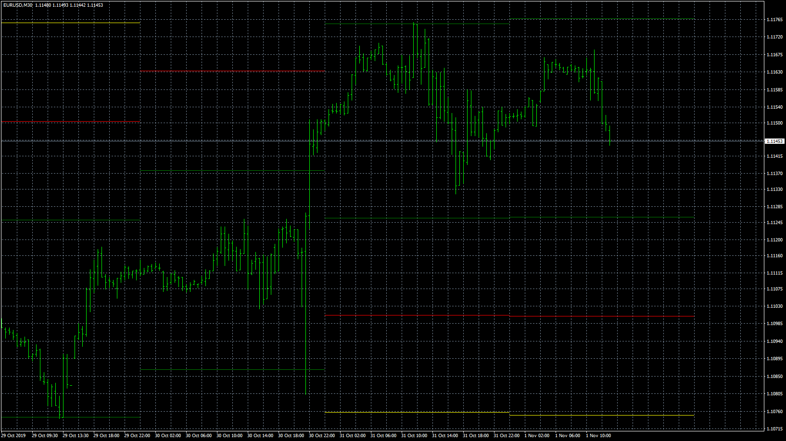

# DailyATRange

> Source: https://fxcodebase.com/code/viewtopic.php?f=38&t=69204  
> Forum: 38 · Topic 69204 · 8 post(s)

---

## DailyATRange

**Apprentice** · Fri Dec 06, 2019 2:37 pm

Based on request.
[viewtopic.php?f=27&t=69194](https://fxcodebase.com/code/viewtopic.php?f=27&t=69194)

 [DailyATRange.mq4](files/130120/DailyATRange.mq4)

---

## Re: DailyATRange

**leviticus83** · Thu Oct 29, 2020 1:55 pm

Thank you for such wonderful indicator! Can I please request the version with show/hide button? Also indi should "remember" the status of DailyATRange when changing TFs. If before it was hidden, it should remain hidden, and if shown - then on TF change it must also show DailyATRrange lines. Thank you once again!

---

## Re: DailyATRange

**Apprentice** · Fri Oct 30, 2020 11:53 am

Your request is added to the development list.
Development reference 2239.

---

## Re: DailyATRange

**Apprentice** · Mon Nov 02, 2020 3:16 am

[DailyATRange_ver1.mq4](files/138600/DailyATRange_ver1.mq4)

Try this version.

---

## Re: DailyATRange

**leviticus83** · Mon Nov 02, 2020 1:52 pm

> **Apprentice wrote:**
>
>
> DailyATRange_ver1.mq4
>
>
> Try this version.

Thanks for quick mod, Apprentice. Unfortunately at my end after quick test the mod doesn't work as it should. Although the button hides all the zones after click, but current daily zones redraw when there is a tick. Also when changed the TF, zones for each day redraw, although they should remember through GV that the button was pressed and shouldn't draw these zones at all...

---

## Re: DailyATRange

**Apprentice** · Tue Nov 03, 2020 4:33 am

Your request is added to the development list.
Development reference 2245.

---

## Re: DailyATRange

**Apprentice** · Wed Nov 04, 2020 9:01 am

Try it now.

---

## Re: DailyATRange

**leviticus83** · Wed Nov 04, 2020 11:13 am

> **Apprentice wrote:**
> Try it now.

Just recently double checked and it finally works. Thank you
