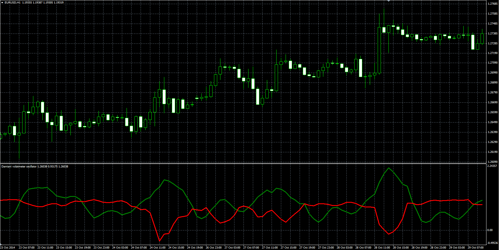

# Damiani volameter

> Source: https://fxcodebase.com/code/viewtopic.php?f=38&t=61676  
> Forum: 38 · Topic 61676 · 1 post(s)

---

## Damiani volameter

**Alexander.Gettinger** · Tue Jan 06, 2015 12:00 pm

Formulas:
Line1[i] = ATR_V/ATR_S+(Line1[i-1]-Line1[3])/2 for Lag_Suppressor, else Line1[i] = ATR_V/ATR_S,
Line2 = Threshold_Level-StdDev_V/StdDev_S, where
ATR_V - ATR with [Viscosity] number of periods,
ATR_S - ATR with [Sedimentation] number of periods,
StdDev_V - standard deviation with [Viscosity] number of periods,
StdDev_S - standard deviation with [Sedimentation] number of periods.

 

Download:

 [Damiani_Volatmeter.mq4](files/98019/Damiani_Volatmeter.mq4)

MT5 version.
[viewtopic.php?f=38&t=70489](https://fxcodebase.com/code/viewtopic.php?f=38&t=70489)
