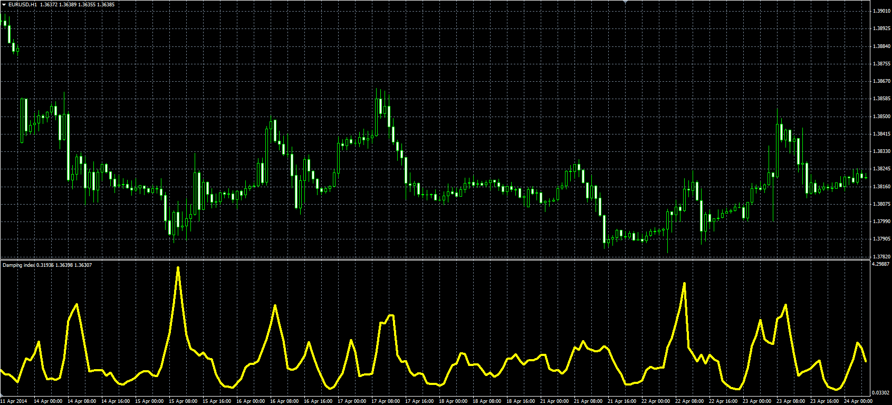

# Damping index oscillator

> Source: https://fxcodebase.com/code/viewtopic.php?f=38&t=60801  
> Forum: 38 · Topic 60801 · 1 post(s)

---

## Damping index oscillator

**Alexander.Gettinger** · Fri Jun 06, 2014 3:48 pm

Original LUA oscillator: [viewtopic.php?f=17&t=33542&p=56911](https://fxcodebase.com/code/viewtopic.php?f=17&t=33542&p=56911).

Formula:
DI = (H-L)/R, where
H = Moving average(High price, Length, Method),
L = Moving average(Low price, Length, Method),
R[i] = H[i-Length]-L[i-Length].

 

Download:

 [DI.mq4](files/94383/DI.mq4)
