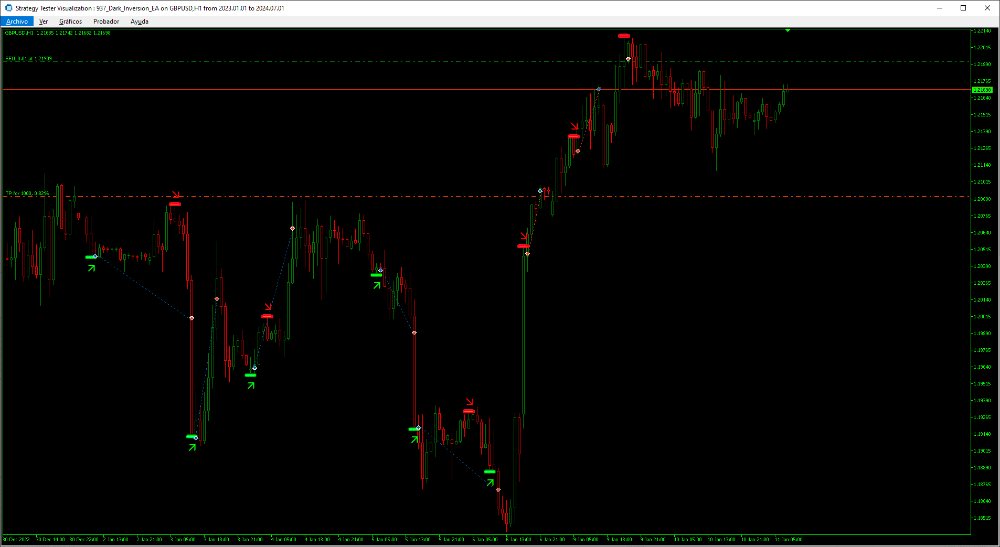
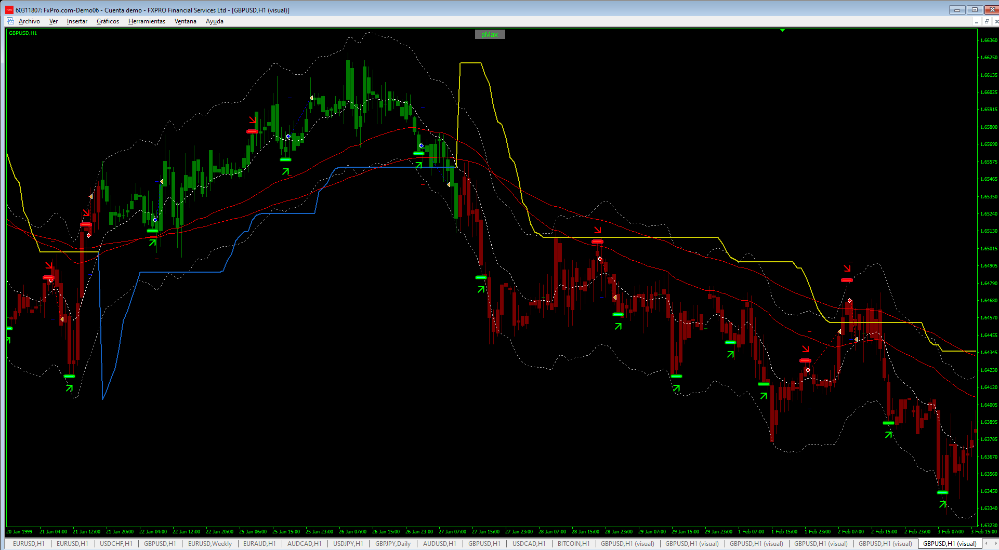
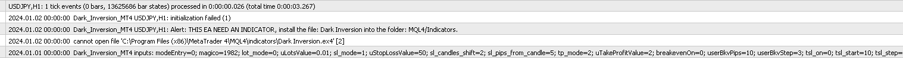
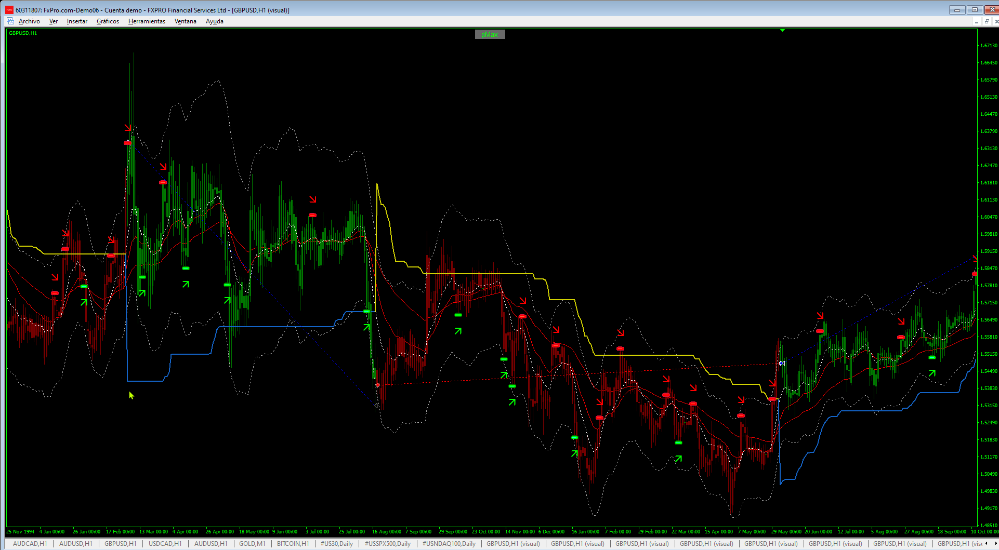

# Dark_Inversion_EA

> Source: https://fxcodebase.com/code/viewtopic.php?f=38&t=75475  
> Forum: 38 · Topic 75475 · 18 post(s)

---

## Dark_Inversion_EA

**Apprentice** · Mon Jan 06, 2025 5:08 pm

Based on the request.
[https://fxcodebase.com/code/viewtopic.php?f=38&t=75445](https://fxcodebase.com/code/viewtopic.php?f=38&t=75445)

 [Dark_Inversion_MT5.ex5](files/157731/Dark_Inversion_MT5.ex5)

 [Dark_Inversion_EA.mq5](files/157731/Dark_Inversion_EA.mq5)

---

## Re: Dark_Inversion_EA

**Apprentice** · Mon Jan 20, 2025 4:43 pm

 [super trend (profit max)1.1.ex4](files/157930/super%20trend%20%28profit%20max%291.1.ex4)

 [Dark_Inversion_MT4.mq4](files/157930/Dark_Inversion_MT4.mq4)

---

## Re: Dark_Inversion_EA

**trtrader** · Tue Jan 21, 2025 7:51 pm

Could you please send ex4 indicator file as well or make the source market folder ?

---

## Re: Dark_Inversion_EA

**[email protected]** · Thu Jan 23, 2025 2:55 am

> **Apprentice wrote:**
>
>
> 18.png
>
>
>
>
> super trend (profit max)1.1.ex4
>
>
>
>
> Dark_Inversion_MT4.mq4

Hi. Thanks for your great work. its really a good MT4 Expert with filter but needs some changes.

Please add these options to MT4 version inputs:

1- In Close On Opposite please add:
 A- Close On Opposite Dark Inversion Signal (True/False)
 B- Close On Opposite Supper Trend Signal (True/False)

2-Add super trend parameters: "calculate period" and "calculate deviation" in input of EA that user can change and optimize it.

Thanks in advance.

---

## Re: Dark_Inversion_EA

**[email protected]** · Thu Jan 23, 2025 6:57 am

Please also add these options for MT4 version:

3-PROFIT PER DAY BY CURRENCY (TRUE AND FALSE)
4-LOSE PER DAY BY CURRENCY (TRUE AND FALSE)
5-Max spread
6-Trade Hours limits each day.

Thanks in advance.

---

## Re: Dark_Inversion_EA

**Apprentice** · Thu Jan 23, 2025 3:15 pm

We have added your request to the development list.
Development reference 47

---

## Re: Dark_Inversion_EA

**[email protected]** · Thu Jan 23, 2025 6:33 pm

> **trtrader wrote:**
>
>
> The attachment **err.png** is no longer available
>
>
>
> Could you please send ex4 indicator file as well or make the source market folder ?

you can find and download the Indicator on the site [https://www.mql5.com](https://www.mql5.com)

[https://www.mql5.com/en/market/product/ ... 006%3adark](https://www.mql5.com/en/market/product/66785?source=Site+Market+MT4+Indicator+Free+Search+Rating006%3adark)

its a free indicator for mt4 and mt5.

install that on market folder and indicator folder. I attach it for you.

---

## Re: Dark_Inversion_EA

**Apprentice** · Mon Jan 27, 2025 2:56 pm

[Dark_Inversion_MT4.mq4](files/158037/Dark_Inversion_MT4.mq4)

Try this version.

---

## Re: Dark_Inversion_EA

**[email protected]** · Tue Jan 28, 2025 9:20 am

> **Apprentice wrote:**
>
>
> The attachment **Dark_Inversion_MT4.mq4** is no longer available
>
>
> Try this version.

Hi.
The super trend parameters (data in INPUT "calculate period" and "calculate deviation" in input of EA ) are incorrectly placed in the indicator and EA. The numbers introduced in INPUT are different from the numbers used in EA. And the super trend shape is drawn incorrectly and the super trend is aligned with the middle of the channel, which is wrong. Please solve this problem.

Thanks in advance.

---

## Re: Dark_Inversion_EA

**Apprentice** · Sat Feb 01, 2025 4:41 pm

We have added your request to the development list.
Development reference 70

---

## Re: Dark_Inversion_EA

**sachFx** · Wed Feb 12, 2025 2:55 pm

> **Apprentice wrote:**
>
>
> 937.png
>
>
> Based on the request.
> [https://fxcodebase.com/code/viewtopic.php?f=38&t=75445](https://fxcodebase.com/code/viewtopic.php?f=38&t=75445)
>
>
> Dark_Inversion_MT5.ex5
>
>
>
>
> Dark_Inversion_EA.mq5

The Expert work great, thanks,
I think could be better if we add the Grid strategy when you have a loser trade:
E.g: Buy trade, market go down, and the expert open new buy (to average the entry price), every 50 pips (seteable) against the trade
Please in the original MT5 version, not with the other requests,

I think can be a cool addition.

thanks

---

## Re: Dark_Inversion_EA

**Apprentice** · Wed Feb 12, 2025 3:24 pm

We have added your request to the development list.
Development reference 107

---

## Re: Dark_Inversion_EA

**Apprentice** · Wed Feb 19, 2025 7:04 am

[Dark_Inversion_EA_Grid.mq5](files/158317/Dark_Inversion_EA_Grid.mq5)

Try this version.

---

## Re: Dark_Inversion_EA

**Apprentice** · Wed Feb 19, 2025 1:50 pm

Task 70

 [Dark_Inversion_MT4_v2.mq4](files/158328/Dark_Inversion_MT4_v2.mq4)

---

## Re: Dark_Inversion_EA

**[email protected]** · Fri Feb 21, 2025 12:47 pm

> **Apprentice wrote:**
> Task 70
>
>
> The attachment **Dark_Inversion_MT4_v2.mq4** is no longer available

Hi. Please make the following changes to the EA "Dark_Inversion_MT4_v2.mq4".
1- Entering trades with the super trend (profit max) indicator signals.
2- Two options should be included in the EA's input to close trades.
a-Exit based on the reverse signal of the Super Trend indicator (true/false).
b-Exit based on the reverse signal of the Dark_Inversion Indicator (true/false).
 Note that the Super Trend indicator itself has buy and sell signals, and these signals have nothing to do with the intersection of the candles with the Super Trend line. Valid buy and sell signals are shown in the figure.
The other options and input of the last EA are good and should not be changed.

Thanks in advance.

---

## Re: Dark_Inversion_EA

**[email protected]** · Fri Feb 21, 2025 1:14 pm

> **Apprentice wrote:**
> Task 70
>
>
> Dark_Inversion_MT4_v2.mq4

Please keep the Super Trend parameters that were present in the inputs in the previous version in the new version, that user can change and optimize it.("calculate period" and "calculate deviation")

---

## Re: Dark_Inversion_EA

**Apprentice** · Sat Feb 22, 2025 5:28 am

We have added your request to the development list.
Development reference 131

---

## Re: Dark_Inversion_EA

**Apprentice** · Mon Feb 24, 2025 5:48 am

 [Dark_Inversion_MT4_v2.mq4](files/158379/Dark_Inversion_MT4_v2.mq4)
