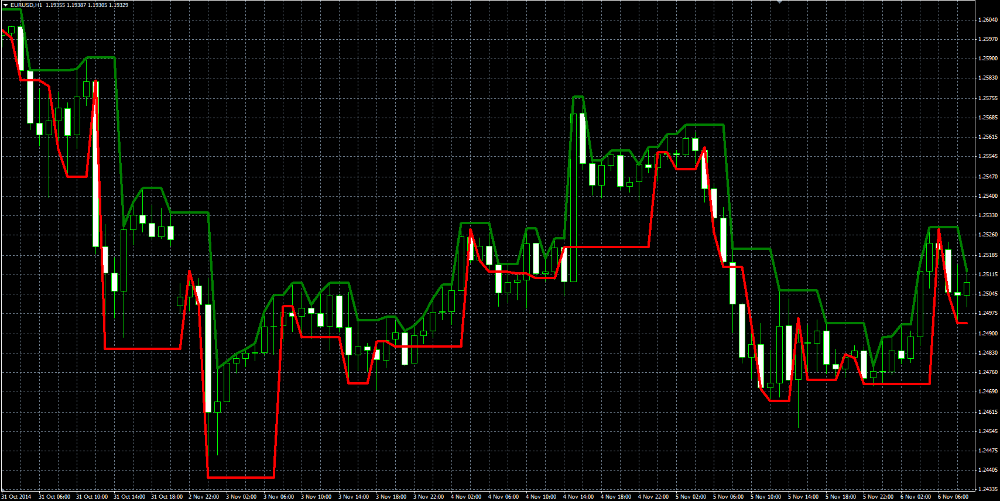

# Darvas box indicator

> Source: https://fxcodebase.com/code/viewtopic.php?f=38&t=61675  
> Forum: 38 · Topic 61675 · 6 post(s)

---

## Darvas box indicator

**Alexander.Gettinger** · Tue Jan 06, 2015 11:52 am

Description: [http://www.investopedia.com/terms/d/darvasboxtheory.asp](http://www.investopedia.com/terms/d/darvasboxtheory.asp).

 

Download:

 [Darvas_Box.mq4](files/98018/Darvas_Box.mq4)

---

## Re: Darvas box indicator

**virtuado** · Wed Mar 20, 2019 1:28 pm

Hi, is there a possibility that this indicator can be coded in the intial way, with separate boxes and after a breakout a new box starts forming.

[http://www.boxcharts.com/images/charts/ ... e-big2.jpg](http://www.boxcharts.com/images/charts/darvas-box-example-big2.jpg)

---

## Re: Darvas box indicator

**Apprentice** · Thu Mar 21, 2019 3:56 pm

Can you provide a logic behind it?

---

## Re: Darvas box indicator

**RonyRossJR** · Wed Dec 18, 2019 3:17 am

dear Sir,
can you add Period parameter in this indicator.

thanks in advance

---

## Re: Darvas box indicator

**Apprentice** · Wed Dec 18, 2019 4:30 pm

Something likeDochian channel?
[viewtopic.php?f=38&t=20206](https://fxcodebase.com/code/viewtopic.php?f=38&t=20206)

---

## Re: Darvas box indicator

**RonyRossJR** · Wed Dec 18, 2019 10:12 pm

> **Apprentice wrote:**
> Something likeDochian channel?
> [viewtopic.php?f=38&t=20206](https://fxcodebase.com/code/viewtopic.php?f=38&t=20206)

yes this is it, thank you sir
