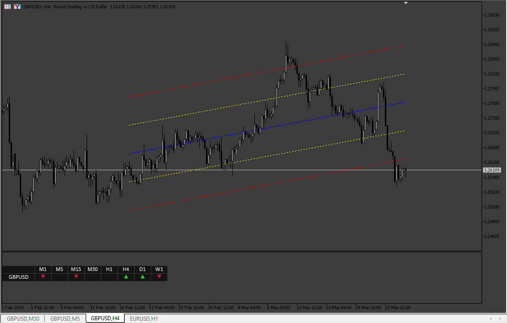
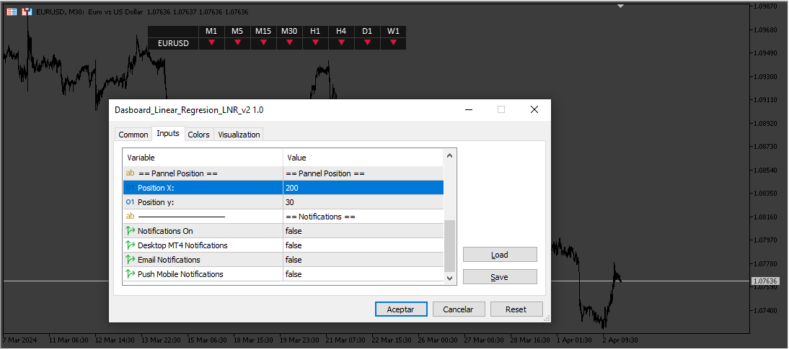
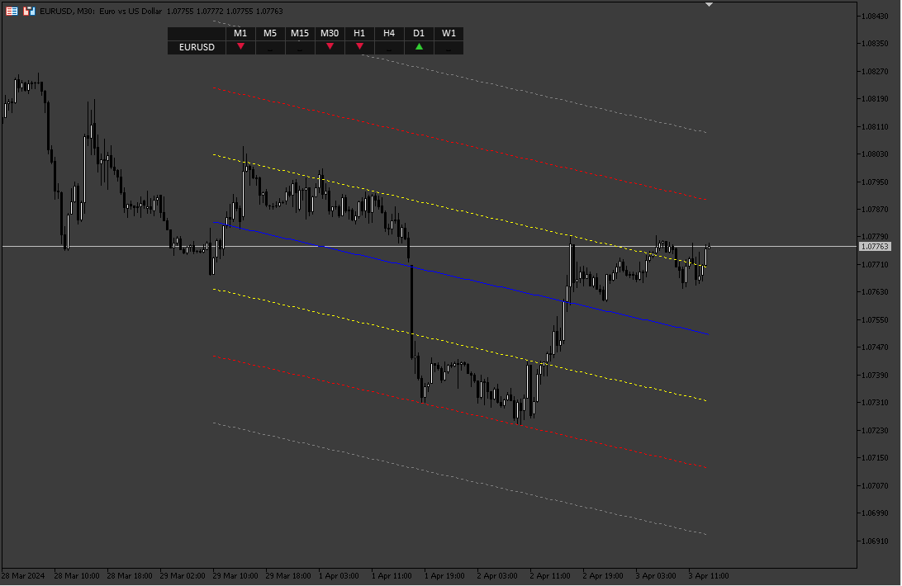

# Dasboard_Linear_Regresion_LNR

> Source: https://fxcodebase.com/code/viewtopic.php?f=38&t=74734  
> Forum: 38 · Topic 74734 · 6 post(s)

---

## Dasboard_Linear_Regresion_LNR

**Apprentice** · Mon Mar 25, 2024 6:15 pm

Based on the request.
[https://fxcodebase.com/code/viewtopic.php?f=27&p=154724](https://fxcodebase.com/code/viewtopic.php?f=27&p=154724)

 [lrchannel.mq5](files/154829/lrchannel.mq5)

 [Dasboard_Linear_Regresion_LNR.mq5](files/154829/Dasboard_Linear_Regresion_LNR.mq5)

---

## Re: Dasboard_Linear_Regresion_LNR

**logicgate** · Mon Mar 25, 2024 8:01 pm

Thanks a lot buddy, seems to be working as requested, I will let you know if anything weird comes up.

I would have preferred that the dashboard were the drag and drop kind, on the chart, not on a subwindow though.

Best regards

---

## Re: Dasboard_Linear_Regresion_LNR

**logicgate** · Tue Mar 26, 2024 5:10 am

Dear friend Apprentice,

I have been using the strategy tester to replay it and I think this would benefit from a little upgrade for a better visual representation of where price is.

Can you add an extra standard deviation to the lnrchannel?

Then price gets above or below the extra STD, we get a yellow arrow (does not matter if buy or sell area), yellow arrow means it's overextended above/below extra STD.

Also, for us to heave at least an idea of where price is on the lnrchannel of other timeframes, we could get a gray arrow when price is above the central line (but below the upper lines), and a white arrow when price is bellow the central line (but above the lower lines).

I made a screenshot to explain:

Best regards

---

## Re: Dasboard_Linear_Regresion_LNR

**Apprentice** · Wed Mar 27, 2024 10:01 am

We have added your request to the development list.
Development reference 258

---

## Re: Dasboard_Linear_Regresion_LNR

**Apprentice** · Mon Apr 08, 2024 4:50 am

 

 [lrchannel.mq5](files/154971/lrchannel.mq5)

 [Dasboard_Linear_Regresion_LNR_v2.mq5](files/154971/Dasboard_Linear_Regresion_LNR_v2.mq5)

---

## Re: Dasboard_Linear_Regresion_LNR

**logicgate** · Wed May 22, 2024 6:57 am

Thanks buddy!
