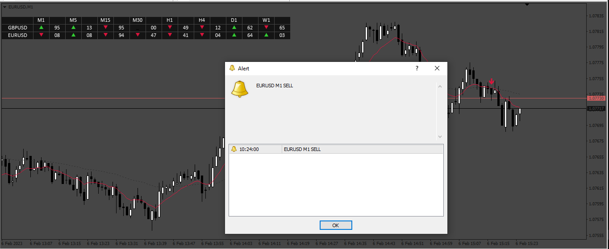
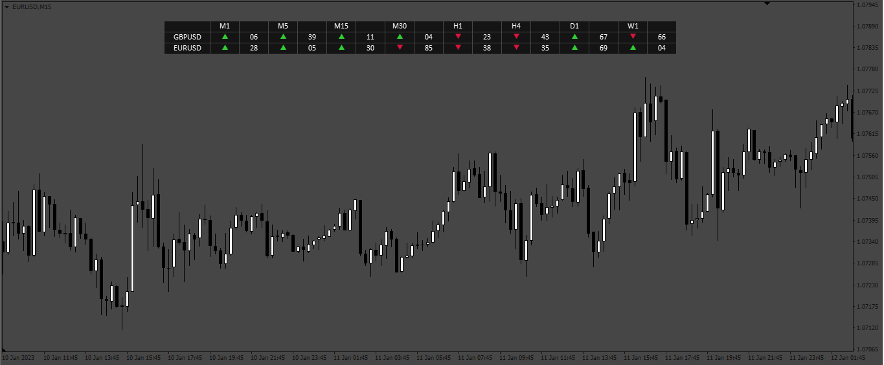
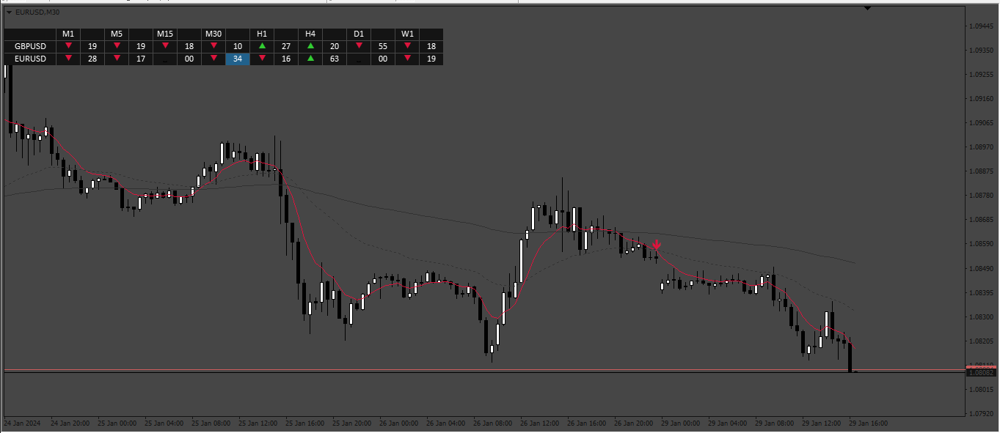
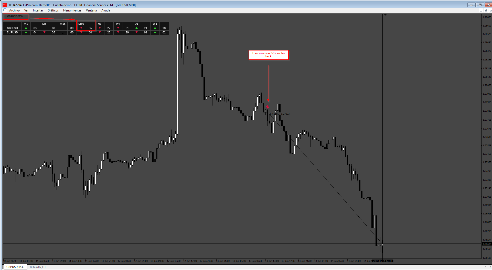
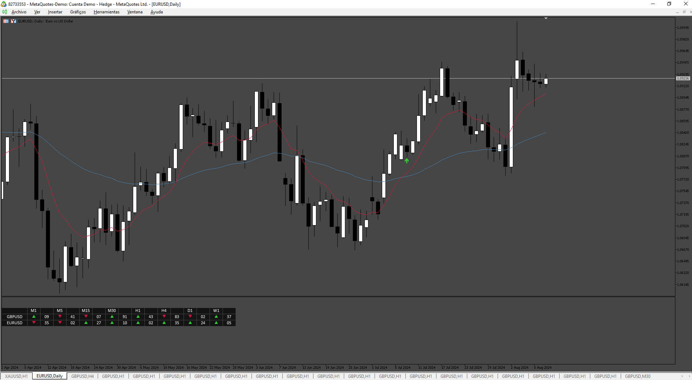

# Dashboard_EMA_cross

> Source: https://fxcodebase.com/code/viewtopic.php?f=38&t=73364  
> Forum: 38 · Topic 73364 · 16 post(s)

---

## Dashboard_EMA_cross

**Apprentice** · Fri Feb 10, 2023 8:26 am

Based on request.
[https://fxcodebase.com/code/viewtopic.php?f=27&p=149484](https://fxcodebase.com/code/viewtopic.php?f=27&p=149484)

 [Dashboard_EMA_cross.mq4](files/149591/Dashboard_EMA_cross.mq4)

---

## Re: Dashboard_EMA_cross

**blackworldpremium** · Fri Feb 10, 2023 4:33 pm

thanks admin

by the way can you enable input to adjust size table and to make it center or not

thanks again for your hardworks

---

## Re: Dashboard_EMA_cross

**Apprentice** · Mon Feb 13, 2023 7:43 am

We have added your request to the development list.
Development reference 149.

---

## Re: Dashboard_EMA_cross

**Apprentice** · Thu Feb 16, 2023 3:08 pm

 [Dashboard_EMA_cross.mq4](files/149661/Dashboard_EMA_cross.mq4)

---

## Re: Dashboard_EMA_cross

**blackworldpremium** · Fri Feb 17, 2023 2:29 am

hi admin
thanks for your hardwork

btw can you make enable for height adjustment also

thanks in advanced

---

## Re: Dashboard_EMA_cross

**polyglot** · Thu Jun 22, 2023 1:57 pm

Hi,

This indicator is great, but is it possible to customize which timeframes are used?

I do not want M1 or M5.

Thanks!

---

## Re: Dashboard_EMA_cross

**Apprentice** · Fri Jun 23, 2023 4:28 am

We have added your request to the development list.
Development reference 562.

---

## Re: Dashboard_EMA_cross

**Stomp2k** · Wed Jan 24, 2024 3:30 am

Can the dashboard be modified for a 3rd ema confirmation.
example: ema1=8, ema2=34, ema3=136 (only bullish above ema3 or bearish below ema 3)
when ema1 crosses above ema2 AND BOTH must be above ema3, THEN dashboard turns bullish.
when ema1 crosses above ema2 and either is Below the ema3, THEN dashboard turns neutral.
when ema1 crosses below ema2 AND BOTH must be below ema3, THEN dashboard turns Bearish.
when ema1 crosses below ema2 and either is Above the ema3, THEN dashboard turns neutral.

Prefer mt4, still with alerts, and possible to toggle on off which timeframes to display

---

## Re: Dashboard_EMA_cross

**Apprentice** · Thu Jan 25, 2024 3:28 pm

We have added your request to the development list.
Development reference 107

---

## Re: Dashboard_EMA_cross

**Apprentice** · Thu Feb 01, 2024 12:45 pm

 [Dashboard_EMA_cross_v2.mq4](files/154236/Dashboard_EMA_cross_v2.mq4)

---

## Re: Dashboard_EMA_cross

**anangfx** · Sat Jun 08, 2024 11:05 pm

hi admin

Can you explain the meaning and details of the numbers above?

---

## Re: Dashboard_EMA_cross

**Apprentice** · Wed Jun 12, 2024 3:18 pm

We have added your request to the development list.
Development reference 493

---

## Re: Dashboard_EMA_cross

**Apprentice** · Tue Jun 18, 2024 1:20 pm

---

## Re: Dashboard_EMA_cross

**Frank8093** · Fri Aug 09, 2024 4:43 am

Dear Sir

Can You add MT5 File.

Regards

---

## Re: Dashboard_EMA_cross

**Apprentice** · Sat Aug 10, 2024 6:59 pm

We have added your request to the development list.
Development reference 643

---

## Re: Dashboard_EMA_cross

**Apprentice** · Mon Aug 12, 2024 2:46 pm

 [Dashboard_MA_cross_MT5.mq5](files/156406/Dashboard_MA_cross_MT5.mq5)
