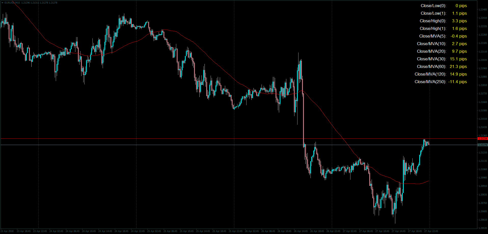

# Data Overlay

> Source: https://fxcodebase.com/code/viewtopic.php?f=38&t=65975  
> Forum: 38 · Topic 65975 · 1 post(s)

---

## Data Overlay

**Apprentice** · Tue May 01, 2018 6:04 am

LUA Original: [viewtopic.php?f=17&t=7183](https://fxcodebase.com/code/viewtopic.php?f=17&t=7183)

Description:

This simple indicator displays the following information:

"Close/Low", "Close/Low(-1)", "High/Close(-1), "High/Close(-1)" and "MVA( PERIOD")/Close

For these Periods: 5,10, 20, 30, 60, 120, 250.

The data is displayed in Pips.

 [Data_Overlay.mq4](files/118899/Data_Overlay.mq4)
