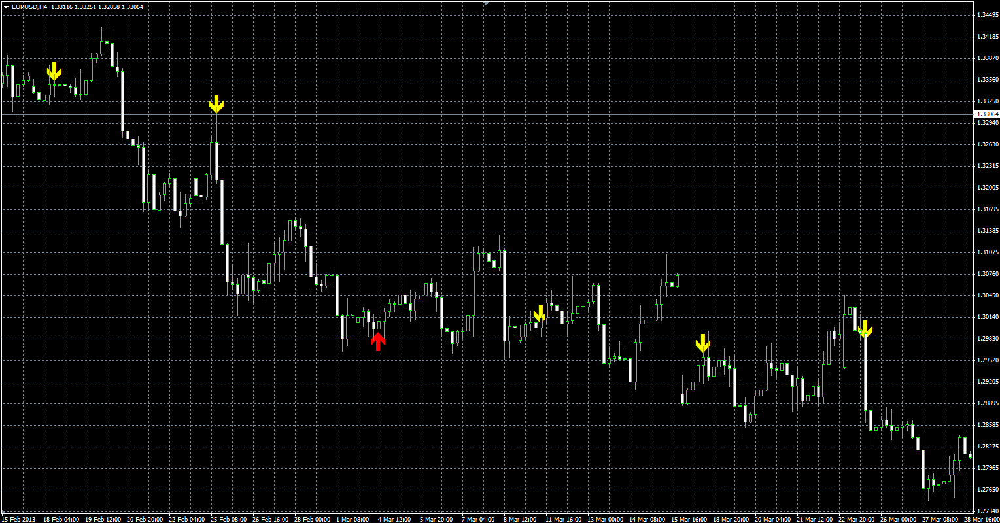

# Day&Time signal indicator

> Source: https://fxcodebase.com/code/viewtopic.php?f=38&t=40837  
> Forum: 38 · Topic 40837 · 1 post(s)

---

## Day&Time signal indicator

**Alexander.Gettinger** · Thu Jun 13, 2013 11:31 am

The indicator produces a signal at the specified time and day of the week.
UP - if current close < previous day open,
DN - if current close > previous day open.

 

Download:

 [DayTime.mq4](files/66866/DayTime.mq4)
