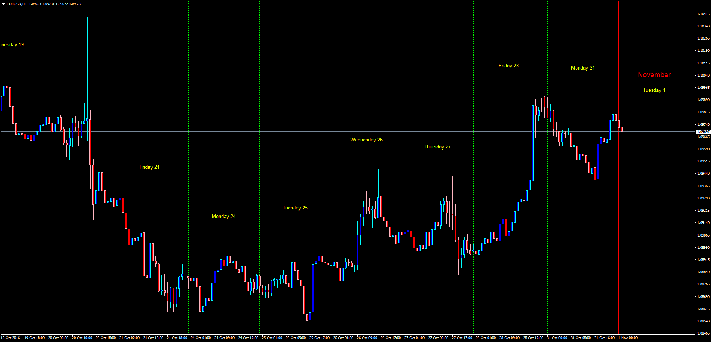
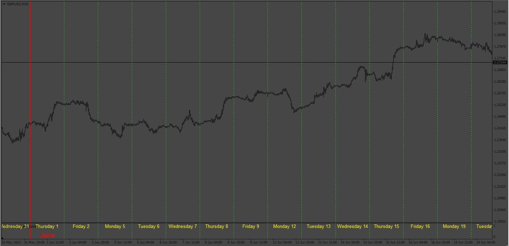
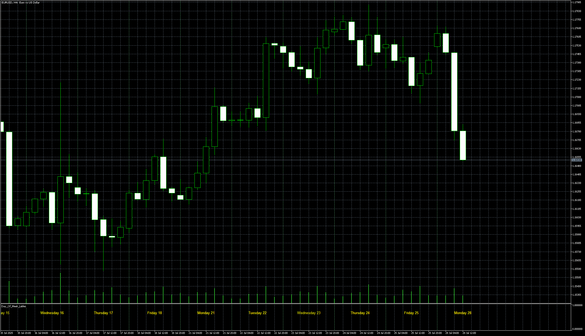

# Days of Week Labels

> Source: https://fxcodebase.com/code/viewtopic.php?f=38&t=64044  
> Forum: 38 · Topic 64044 · 13 post(s)

---

## Days of Week Labels

**Apprentice** · Tue Nov 01, 2016 4:03 am

Lua original.
[viewtopic.php?f=17&t=24023&hilit=Day_Of_Week_Lables.lua](https://fxcodebase.com/code/viewtopic.php?f=17&t=24023&hilit=Day_Of_Week_Lables.lua)

Description:

This indicator will display the days of the week labels and day separators. It will also do the same for months. Custom colors and styles can be selected in the windows options.

 [#Day_Of_Week_Lables.mq4](files/108867/Day_Of_Week_Lables.mq4)

---

## Re: Days of Week Labels

**logicgate** · Sun May 21, 2023 6:58 am

Hello dear friend apprentice, can you please update the indicator to make it display the labels at the bottom of the chart, centered on each day? Like the image attached here.

---

## Re: Days of Week Labels

**Apprentice** · Wed May 24, 2023 12:39 pm

We have added your request to the development list.
Development reference 476.

---

## Re: Days of Week Labels

**logicgate** · Sun Jun 18, 2023 10:38 am

Thanks a lot!

---

## Re: Days of Week Labels

**logicgate** · Sun Jun 18, 2023 10:41 am

It would be great a version for MT5 too.

---

## Re: Days of Week Labels

**logicgate** · Mon Jun 19, 2023 8:22 am

Hey buddy the indicator still shows the month label even if you set color to none.

Can you make the labels print inside an indicator subwindow instead of the chart? You can hard code the height of the window to be like a stripe, so the labels will be inside the stripe so it looks neater.

---

## Re: Days of Week Labels

**logicgate** · Mon Jun 19, 2023 12:22 pm

There is also a bug making some of the labels to not stick to the bottom of the chart, and they just float around.

That' s why it' s better if you confine the labels inside an indicator subwindow and resize it down to a stripe.

---

## Re: Days of Week Labels

**Apprentice** · Wed Jun 21, 2023 9:23 am

We have added your request to the development list.
Development reference 545.

---

## Re: Days of Week Labels

**Apprentice** · Mon Jun 26, 2023 3:24 pm

 [#Day_Of_Week_Lables.mq4](files/151427/Day_Of_Week_Lables.mq4)

---

## Re: Days of Week Labels

**logicgate** · Tue Jun 27, 2023 6:53 am

Beautiful let me test it buddy. Thanks!

---

## Re: Days of Week Labels

**syncoopate** · Thu Jul 06, 2023 9:22 am

please for mt5 with month and week

---

## Re: Days of Week Labels

**Apprentice** · Fri Jul 07, 2023 12:35 pm

We have added your request to the development list.
Development reference 586.

---

## Re: Days of Week Labels

**Apprentice** · Mon Jul 28, 2025 6:08 am

 [Day_Of_Week_Lables.mq5](files/160060/Day_Of_Week_Lables.mq5)
