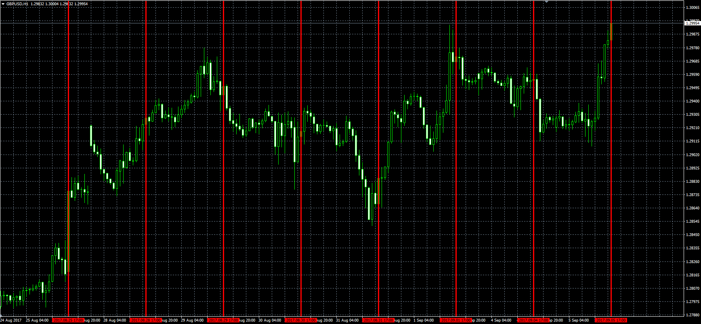

# Daystart vertical line

> Source: https://fxcodebase.com/code/viewtopic.php?f=38&t=65056  
> Forum: 38 · Topic 65056 · 1 post(s)

---

## Daystart vertical line

**Alexander.Gettinger** · Tue Sep 05, 2017 11:21 am

The simple indicator which just draws a vertical line at the beginning of chose hour (17:00EST by default).

 

Download:

 [Day_Start_Line.mq4](files/114709/Day_Start_Line.mq4)
