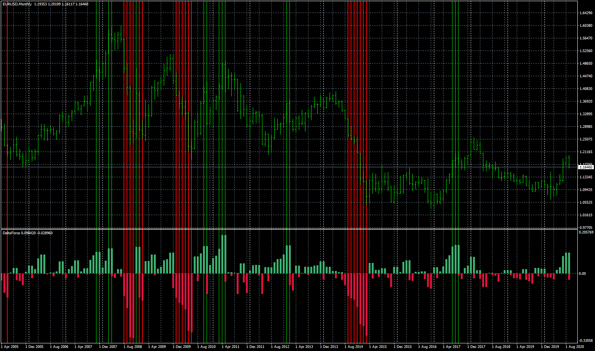
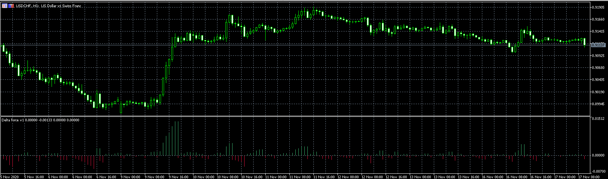

# Delta_Force

> Source: https://fxcodebase.com/code/viewtopic.php?f=38&t=70588  
> Forum: 38 · Topic 70588 · 16 post(s)

---

## Delta_Force

**Apprentice** · Mon Nov 02, 2020 3:25 am

Based on request.
[viewtopic.php?f=27&t=70564](https://fxcodebase.com/code/viewtopic.php?f=27&t=70564)

 [Delta_Force_ver1.mq4](files/138603/Delta_Force_ver1.mq4)

TS2 version
[https://fxcodebase.com/code/viewtopic.php?f=17&t=74382](https://fxcodebase.com/code/viewtopic.php?f=17&t=74382)

---

## Re: Delta_Force

**taipan** · Mon Nov 02, 2020 8:47 pm

> **Apprentice wrote:**
>
>
> eurusd-mn1-fxcm-australia-pty.png
>
>
> Based on request.
> [viewtopic.php?f=27&t=70564](https://fxcodebase.com/code/viewtopic.php?f=27&t=70564)
>
>
> Delta_Force_ver1.mq4

Hi Mario,

Thank for the indicator but there is no alert and arrows as specified in the request:

"As per snapshot, please provide arrows with alert once the triggered threshold exceed the highlighted vertical line. Also, provide the manual inputs for threshold, alert true or false, in the input tab. Also, could it add mq5 version also with same criteria as mq4."

The vertical lines are not required.

cheers,
taipan

---

## Re: Delta_Force

**Apprentice** · Tue Nov 03, 2020 4:31 am

Your request is added to the development list.
Development reference 2244.

---

## Re: Delta_Force

**Apprentice** · Wed Nov 04, 2020 8:58 am

Try this version.

---

## Re: Delta_Force

**taipan** · Thu Nov 05, 2020 12:23 am

Hi Mario,

Thanks for the update of the Delta Force indi. Can you create an mq5 version.

cheers,
taipan

---

## Re: Delta_Force

**Apprentice** · Thu Nov 05, 2020 3:39 am

Your request is added to the development list.
Development reference 2254.

---

## Re: Delta_Force

**taipan** · Thu Nov 05, 2020 4:36 am

Hi Mario,

On the first trial on the Delta Force ver1 indi, the arrows did not show on the chart but the alert worked. The arrow must be show up in the main window of mt4.

cheers,
taipan

---

## Re: Delta_Force

**taipan** · Thu Nov 05, 2020 7:42 pm

> **Apprentice wrote:**
> Try this version.

Hi Mario,
The arrows did not show up during the alert phase. Please fixed. Note that the arrows should appear on the main chart.

cheers,
taipan

---

## Re: Delta_Force

**Apprentice** · Fri Nov 06, 2020 3:24 am

[Delta_Force_ver1.mq5](files/138698/Delta_Force_ver1.mq5)

Try this version.

---

## Re: Delta_Force

**rubbbo** · Tue Nov 10, 2020 4:23 am

> **Apprentice wrote:**
>
>
> The attachment **Delta_Force_ver1.mq5** is no longer available
>
>
> Try this version.

Dear Apprentice

i found those warnings when compiling and indicator is not shown in the chart

 

Thank you for all your hard work

---

## Re: Delta_Force

**Apprentice** · Wed Nov 11, 2020 2:34 pm

Your request is added to the development list.
Development reference 2280.

---

## Re: Delta_Force

**Apprentice** · Tue Nov 17, 2020 6:45 am

These are warnings, not errors. They could be ignored.
And I don't have any issues with the indicator. Do you have some errors in the log?

---

## Re: Delta_Force

**rubbbo** · Wed Nov 18, 2020 5:20 am

Dear Apprentice

MT4 version of the indicator is working fine, showing histogram and arrows but mt5 version is only showing green arrows. No warning in the log tab, it loads without problem but it only shows green arrows as it is shown in the pic below

 

Thank you very much for your help and attention

Best regards!

---

## Re: Delta_Force

**Apprentice** · Wed Nov 18, 2020 8:58 am

Your request is added to the development list.
Development reference 2324.

---

## Re: Delta_Force

**Apprentice** · Wed Nov 18, 2020 11:09 am

[Delta_Force_ver1.mq5](files/138973/Delta_Force_ver1.mq5)

mt5 version is only showing green arrows. No warning in the log tab, it loads without problem but it only shows green arrows as it is shown in the pic below

---

## Re: Delta_Force

**rubbbo** · Wed Nov 18, 2020 3:28 pm

Dear Apprentice

Working perfect!

 thank you!

 

