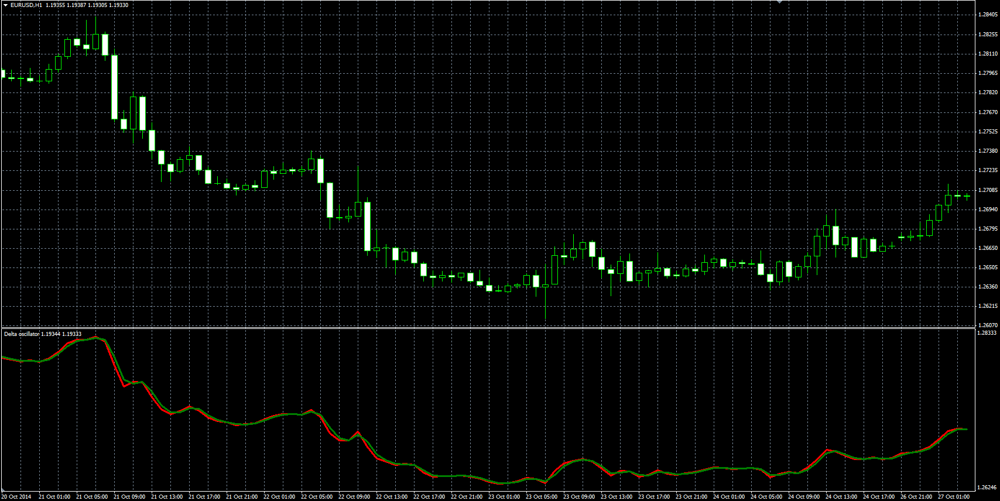

# Delta oscillator

> Source: https://fxcodebase.com/code/viewtopic.php?f=38&t=61685  
> Forum: 38 · Topic 61685 · 1 post(s)

---

## Delta oscillator

**Alexander.Gettinger** · Thu Jan 08, 2015 4:37 pm

Original LUA oscillator: [viewtopic.php?f=17&t=2156](https://fxcodebase.com/code/viewtopic.php?f=17&t=2156).

Formula:
Delta[i] = Pr[i]+Diff[i], where
Diff[i] = Log10(Pr[i-1]/Pr[i]),
Pr[i] = (Open[i]+High[i]+Low[i]+Close[i])/4,
Log10 - common logarithm.

 

Download:

 [Delta.mq4](files/98042/Delta.mq4)
