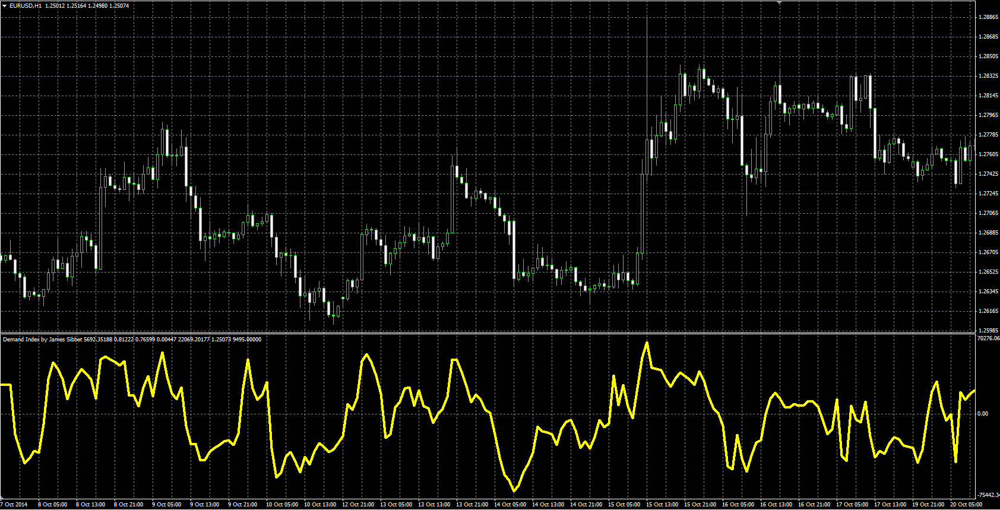

# Demand Index

> Source: https://fxcodebase.com/code/viewtopic.php?f=38&t=61625  
> Forum: 38 · Topic 61625 · 3 post(s)

---

## Demand Index

**Alexander.Gettinger** · Mon Dec 22, 2014 10:22 am

Original LUA oscillator: [viewtopic.php?f=17&t=3020](https://fxcodebase.com/code/viewtopic.php?f=17&t=3020).

> The Demand Index, developed by James Sibbet, combines price and volume,
> it is often a leading indicator of price change.

 

Download:

 [Demand_Index.mq4](files/97830/Demand_Index.mq4)

---

## Re: Demand Index

**Coondawg71** · Mon Mar 16, 2015 6:28 pm

Can we please request a Demand Index Divergence indicator version for the Demand Index.

Thanks!

sjc

---

## Re: Demand Index

**Apprentice** · Tue Mar 17, 2015 5:45 am

Your request is added to the development list.
