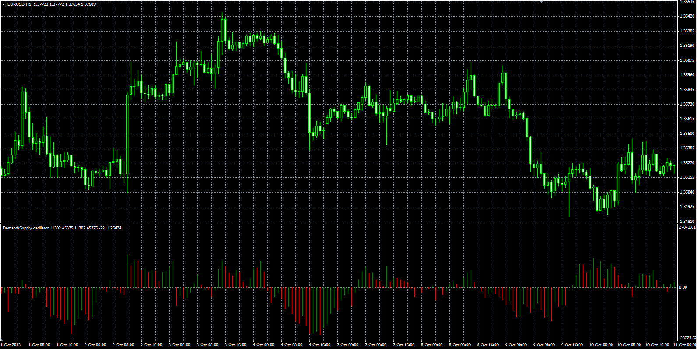
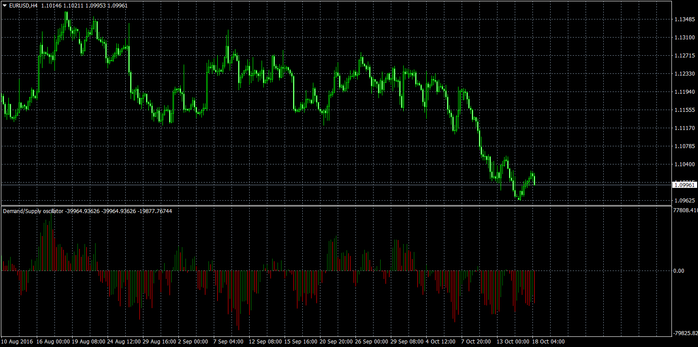

# Demand - Supply oscillator

> Source: https://fxcodebase.com/code/viewtopic.php?f=38&t=60407  
> Forum: 38 · Topic 60407 · 14 post(s)

---

## Demand - Supply oscillator

**Alexander.Gettinger** · Wed Mar 05, 2014 5:14 pm

Original LUA oscillator: [viewtopic.php?f=17&t=60169](https://fxcodebase.com/code/viewtopic.php?f=17&t=60169).

Formulas:
DS = MA(Raw, Length, Method), where
Raw = (Abs((Close-Low)/(High-Low))-Abs((High-Close)/(High-Low)))*Volume.

 

Download:

 [DS.mq4](files/93047/DS.mq4)

---

## Re: Demand - Supply oscillator

**Thecity** · Fri Oct 14, 2016 6:55 pm

It doesn't work! I have an empty window as output!

Could I please have the same version as the .lua one?

Thank you in advance!
(I moved to the mt4 platform )

---

## Re: Demand - Supply oscillator

**Apprentice** · Tue Oct 18, 2016 7:49 am

Can you share your settings, screenshots.

---

## Re: Demand - Supply oscillator

**JADragon3** · Thu Dec 07, 2017 1:05 pm

I think this needs to be updated. Doesn't seem to work

---

## Re: Demand - Supply oscillator

**Apprentice** · Fri Dec 08, 2017 5:24 am

Can you share your settings, Time Frame used, screenshots?

---

## Re: Demand - Supply oscillator

**Apprentice** · Thu Sep 17, 2020 2:01 am

Updated, Fix some issues.

---

## Re: Demand - Supply oscillator

**alienfriend18** · Wed Sep 30, 2020 8:24 am

Please add multipair and multi-timeframe option

---

## Re: Demand - Supply oscillator

**Apprentice** · Wed Sep 30, 2020 10:43 am

As a dashboard or as an addon to the current indicator?

---

## Re: Demand - Supply oscillator

**alienfriend18** · Wed Sep 30, 2020 12:18 pm

as addon
and if possible convert it to line

---

## Re: Demand - Supply oscillator

**Apprentice** · Fri Oct 02, 2020 2:14 am

Your request is added to the development list.
Development reference 2133.

---

## Re: Demand - Supply oscillator

**Apprentice** · Sat Oct 03, 2020 7:01 am

[DS_ver1.mq4](files/138045/DS_ver1.mq4)

Try this version.

---

## Re: Demand - Supply oscillator

**durlovjagiroad** · Tue Feb 02, 2021 12:23 pm

> **Apprentice wrote:**
>
>
> DS_ver1.mq4
>
>
> Try this version.

Please Normalize this indicator between 0-100 scale. Thanks

---

## Re: Demand - Supply oscillator

**Apprentice** · Thu Feb 04, 2021 7:42 am

Your request is added to the development list.
Development reference 145.

---

## Re: Demand - Supply oscillator

**Apprentice** · Fri Feb 12, 2021 11:06 am

[DS Normilized.mq4](files/140683/DS%20Normilized.mq4)

Try this version.
