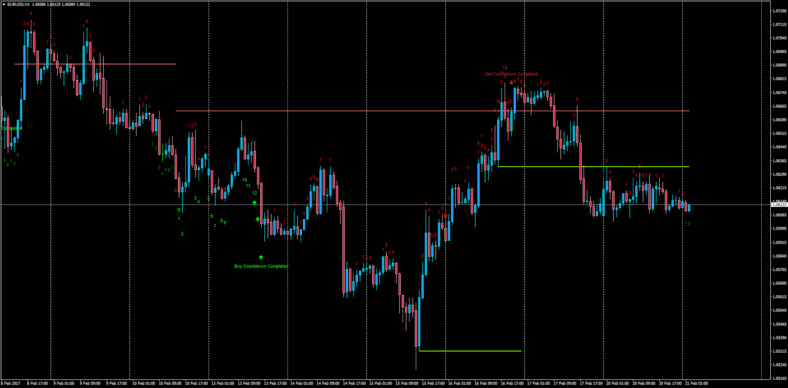

# Demark Sequential

> Source: https://fxcodebase.com/code/viewtopic.php?f=38&t=64473  
> Forum: 38 · Topic 64473 · 5 post(s)

---

## Demark Sequential

**Apprentice** · Tue Feb 21, 2017 5:30 am

Description:

This is the requested MT4 version of the LUA work in progress "Demark Sequential".

 [DEMARK_V1.mq4](files/111135/DEMARK_V1.mq4)

TS2/Lua Version.
[viewtopic.php?f=17&t=646](https://fxcodebase.com/code/viewtopic.php?f=17&t=646)

---

## Re: Demark Sequential

**grimweasel** · Thu Apr 26, 2018 8:39 pm

Hi, great indicator thanks for coding for MT4
A couple of requests if I may?

Can you eliminate or merge Sunday candles?

Is there a way of not displaying incomplete 9 setups to reduce chart clutter? That way the countdowns are easier to see in relation to the corresponding 9 count sell/buy set up?

Is it possible to highlight (in bold or broader circle) those 8&9 bars that close lower/higher than the preceding 6&7 bars (as I believe those that don't are not valid setups)

For the 13 countdowns to be valid, ideally the 1-13 will take place higher/lower than the 9 setup. The 13 bar must be higher (sell setup) than the linked 8 bar of the 9 sell setup and vice versa for buy setup. Currently the Indy is giving invalid 13 buy/sell setup complete signals.

Many thanks

---

## Re: Demark Sequential

**Apprentice** · Fri Apr 27, 2018 4:52 am

Your request is added to the development list under Id Number 4124

---

## Re: Demark Sequential

**grimweasel** · Tue May 01, 2018 6:41 pm

Great! Many thanks Apprentice!

---

## Re: Demark Sequential

**grimweasel** · Fri Feb 15, 2019 6:38 pm

Any news on this indy that was entered into the Dev queue? Thanks
