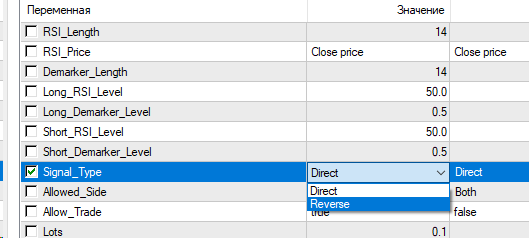

# Demarker RSI EA for MT4

> Source: https://fxcodebase.com/code/viewtopic.php?f=38&t=67382  
> Forum: 38 · Topic 67382 · 6 post(s)

---

## Demarker RSI EA for MT4

**Alexander.Gettinger** · Mon Feb 25, 2019 5:18 pm

Based on request: [viewtopic.php?f=27&t=67373&p=124047#p124047](https://fxcodebase.com/code/viewtopic.php?f=27&t=67373&p=124047#p124047)

Download:

 [Demarker_RSI_EA.mq4](files/124090/Demarker_RSI_EA.mq4)

---

## Re: Demarker RSI EA for MT4

**Sp2562** · Mon Feb 25, 2019 7:27 pm

Sorry to intrude on these developments, did a test on it and gave the following result, could not how to do the reverse?

Where are you buying to launch a sales order?

Where are you selling to launch a purchase order?

Because it is in a constant decision, theoretically if it does the inverse of what it is doing now, it can be that it makes a steady rise.

Could you take this test?

---

## Re: Demarker RSI EA for MT4

**Sp2562** · Mon Feb 25, 2019 7:30 pm

Sorry, I forgot to send the file.

---

## Re: Demarker RSI EA for MT4

**Apprentice** · Wed Feb 27, 2019 6:46 am

Your request is added to the development list under Id Number 4498

---

## Re: Demarker RSI EA for MT4

**Apprentice** · Thu Feb 28, 2019 4:51 am

Try to use Reverse as Signal type.

---

## Re: Demarker RSI EA for MT4

**Sp2562** · Thu Feb 28, 2019 9:31 am

Many thanks for the feedback.

It worked perfectly, but not with the result I imagined.

He made the same descent.

But anyway, thank you.
