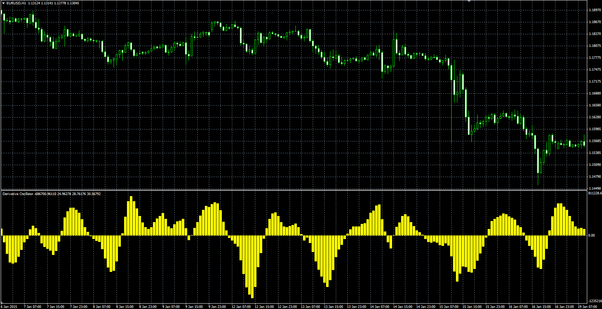

# Derivative Oscillator

> Source: https://fxcodebase.com/code/viewtopic.php?f=38&t=61848  
> Forum: 38 · Topic 61848 · 1 post(s)

---

## Derivative Oscillator

**Alexander.Gettinger** · Fri Feb 20, 2015 5:29 pm

Original LUA oscillator: [viewtopic.php?f=17&t=537](https://fxcodebase.com/code/viewtopic.php?f=17&t=537).

Formula:
DEROSC = EMA2-MVA(EMA2, MVA_Length), where
EMA2 = EMA(EMA1) with [EMA2_Length] number of periods,
EMA1 = EMA(RSI) with [EMA1_Length] number of periods,
RSI - Relative Strength Index with [RSI_Length] number of periods.

 

Download:

 [DEROSC.mq4](files/98763/DEROSC.mq4)
