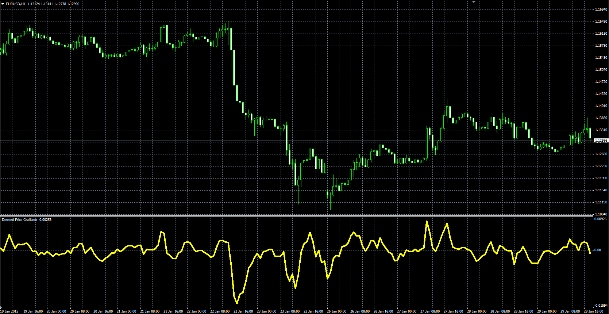

# Detrend Price Oscillator

> Source: https://fxcodebase.com/code/viewtopic.php?f=38&t=61846  
> Forum: 38 · Topic 61846 · 1 post(s)

---

## Detrend Price Oscillator

**Alexander.Gettinger** · Fri Feb 20, 2015 5:23 pm

Original LUA oscillator: [viewtopic.php?f=17&t=716](https://fxcodebase.com/code/viewtopic.php?f=17&t=716).

Formula:
DPO = Price-MA, where
MA - simple moving average with [len] number of periods,
len = Length/2 + 1.

 

Download:

 [DPO.mq4](files/98761/DPO.mq4)
