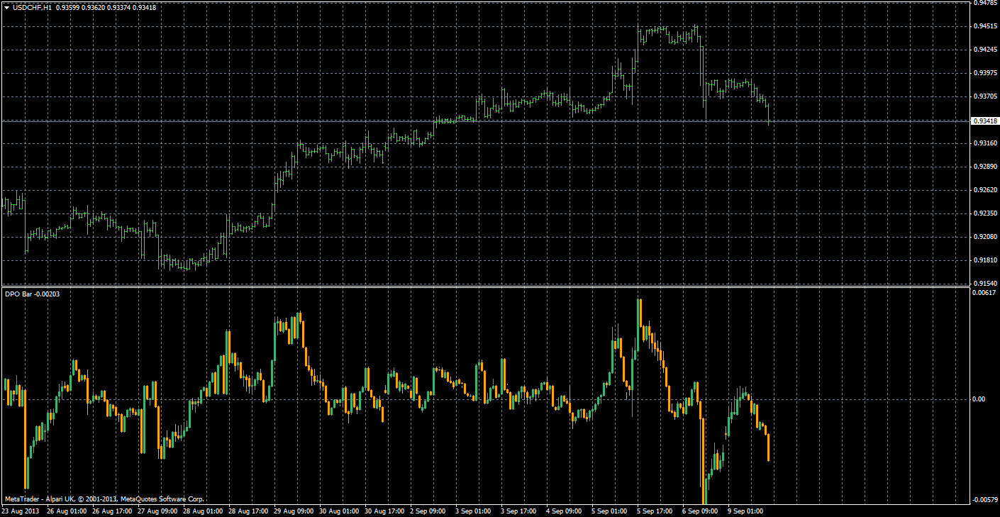

# Detrended Price Oscillator Bar

> Source: https://fxcodebase.com/code/viewtopic.php?f=38&t=59433  
> Forum: 38 · Topic 59433 · 4 post(s)

---

## Detrended Price Oscillator Bar

**Apprentice** · Mon Sep 09, 2013 7:43 am

Detrended Price Oscillator eliminates the trend effect of price movement. This simplifies the process of finding out cycles and levels of outbidding/resale.

Long-term cycles consist of several shorter cycles. Analyzing such short components helps to define crucial moments of the cycle's development. DPO gives a chance to eliminate the influence on prices of long-term cycles.

Calculations:

DPO = Price - SMA (Price,N)

 [DPO Bar.mq4](files/89289/DPO%20Bar.mq4)

---

## Re: Detrended Price Oscillator Bar

**Luqui1979** · Fri May 01, 2020 9:26 pm

Hi,
DPO Bar doesn't show any bar on the window when I load it on my MT4.
Am I missing something?
Thanks,
Luciano

---

## Re: Detrended Price Oscillator Bar

**Apprentice** · Sat May 02, 2020 5:09 am

Your request is added to the development list.
Development reference 1202.

---

## Re: Detrended Price Oscillator Bar

**Apprentice** · Wed May 06, 2020 6:38 am

Try it now.
