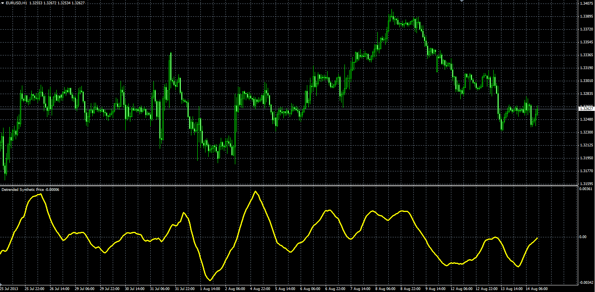

# Detrended Synthetic Price

> Source: https://fxcodebase.com/code/viewtopic.php?f=38&t=59130  
> Forum: 38 · Topic 59130 · 1 post(s)

---

## Detrended Synthetic Price

**Alexander.Gettinger** · Wed Aug 14, 2013 3:10 pm

Original LUA oscillator: [http://fxcodebase.com/code/viewtopic.php?f=17&t=27612](https://fxcodebase.com/code/viewtopic.php?f=17&t=27612).

Formula:
DSP = MA(Length, Method, Price)-MA(2*Length, Method, Price).

 

Download:

 [DSP.mq4](files/88586/DSP.mq4)
