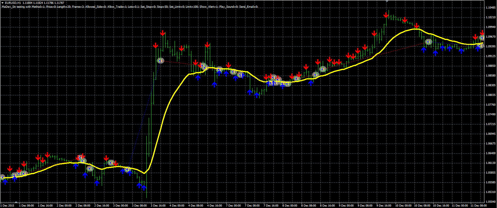

# Deviation from MA strategy

> Source: https://fxcodebase.com/code/viewtopic.php?f=38&t=63280  
> Forum: 38 · Topic 63280 · 1 post(s)

---

## Deviation from MA strategy

**Alexander.Gettinger** · Wed Mar 23, 2016 12:01 pm

The strategy based on Deviation from MA indicator ([viewtopic.php?f=38&t=63066&p=104421](https://fxcodebase.com/code/viewtopic.php?f=38&t=63066&p=104421)).

Buy condition: Up signal from indicator.
Sell condition: Down signal from indicator.

 

Download:

 [MaDev_Str.mq4](files/105415/MaDev_Str.mq4)

Deviation from MA indicator ([viewtopic.php?f=38&t=63066&p=104421](https://fxcodebase.com/code/viewtopic.php?f=38&t=63066&p=104421)) should be installed for correct work.
