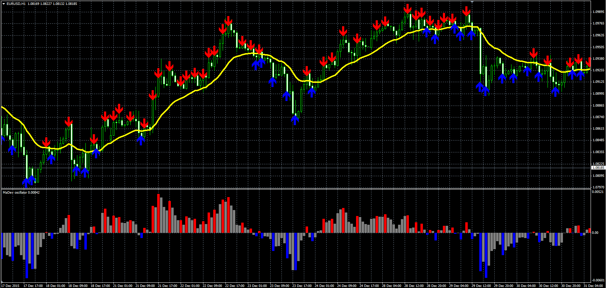

# Deviation from MA

> Source: https://fxcodebase.com/code/viewtopic.php?f=38&t=63066  
> Forum: 38 · Topic 63066 · 2 post(s)

---

## Deviation from MA

**Alexander.Gettinger** · Mon Jan 25, 2016 9:59 am

The indicator shows deviation between MA and price.
For find the maximums used [Frame] bars (as for fractals).
Arrow are shown maximums of the deviation of the price from MA.

 

Download:

 [MaDev.mq4](files/104421/MaDev.mq4)

Oscillator version.
Download:

 [MaDevOsc.mq4](files/104421/MaDevOsc.mq4)

---

## Re: Deviation from MA

**Itssiisi** · Sun Jul 31, 2016 4:18 pm

Hi Alexander

Firstly, I would like to know if first this indicator repaints.

Secondly, does the arrow appear at the close of the candlestick on which the arrows are showing in the picture you attached with the indicator.

Best regards
