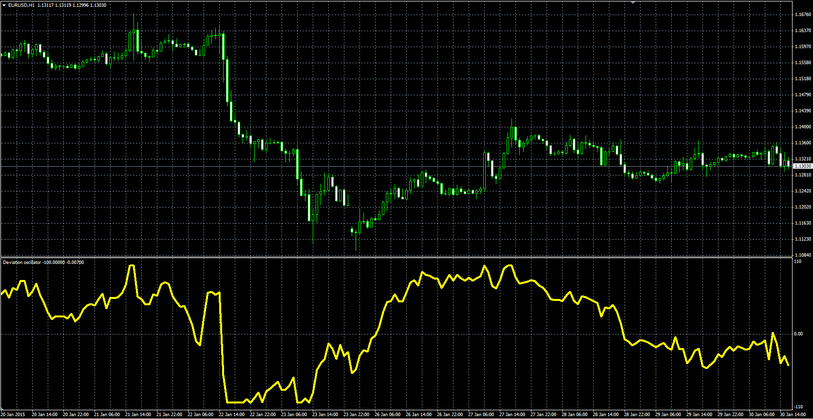

# Deviation Oscillator

> Source: https://fxcodebase.com/code/viewtopic.php?f=38&t=61979  
> Forum: 38 · Topic 61979 · 1 post(s)

---

## Deviation Oscillator

**Alexander.Gettinger** · Mon Mar 09, 2015 3:48 pm

Original LUA oscillator: [viewtopic.php?f=17&t=61365](https://fxcodebase.com/code/viewtopic.php?f=17&t=61365).

Formula:
DO[i] = nf*(PD[i]-Min)-100, where
PD = Price-MA(Price) with [Length1] number of periods and [Method] type,
nf = 200/(Max-Min),
Max, Min - maximum and minimum values of PD at range from [i-Length2+1] to [i].

 

Download:

 [Deviation_Oscillator.mq4](files/99135/Deviation_Oscillator.mq4)
