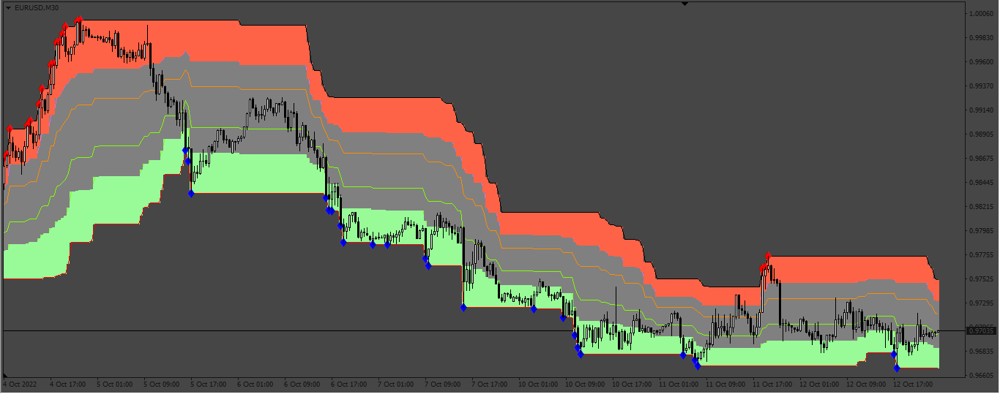

# DFT

> Source: https://fxcodebase.com/code/viewtopic.php?f=38&t=72848  
> Forum: 38 · Topic 72848 · 4 post(s)

---

## DFT

**Apprentice** · Tue Oct 18, 2022 1:24 am

Lua Original
[https://fxcodebase.com/code/viewtopic.php?f=17&t=70626](https://fxcodebase.com/code/viewtopic.php?f=17&t=70626)

 [DFT.mq4](files/147938/DFT.mq4)

 [DFT.mq5](files/147938/DFT.mq5)

---

## Re: DFT

**forexryk** · Sun Jun 23, 2024 4:39 am

looking good indicator possible to convert into mt5 version

---

## Re: DFT

**Apprentice** · Sun Jun 23, 2024 3:13 pm

We have added your request to the development list.
Development reference 510

---

## Re: DFT

**Apprentice** · Wed Jul 03, 2024 1:04 pm

DFT.mq5 added.
