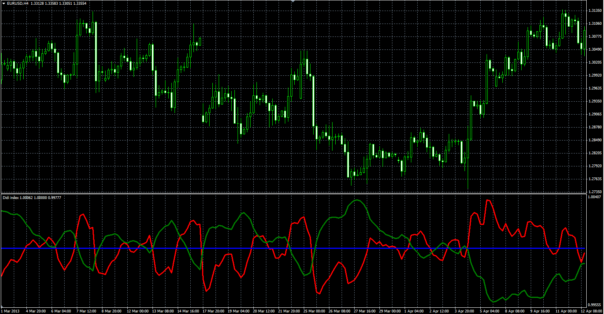

# Didi index

> Source: https://fxcodebase.com/code/viewtopic.php?f=38&t=41320  
> Forum: 38 · Topic 41320 · 1 post(s)

---

## Didi index

**Alexander.Gettinger** · Tue Jun 18, 2013 3:20 pm

Original oscillator: [viewtopic.php?f=17&t=41319](https://fxcodebase.com/code/viewtopic.php?f=17&t=41319)

Formulas:
Curta = MA(Curta_Period)/MA(Media_Period),
Media = 1,
Longa = MA(Longa_Period)/MA(Media_Period).

 

Download:

 [Didi_index.mq4](files/67549/Didi_index.mq4)
