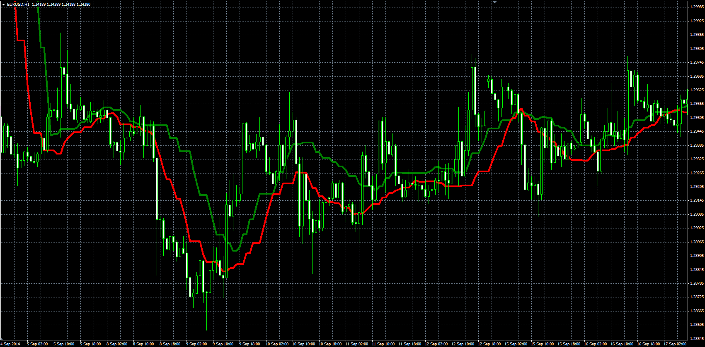
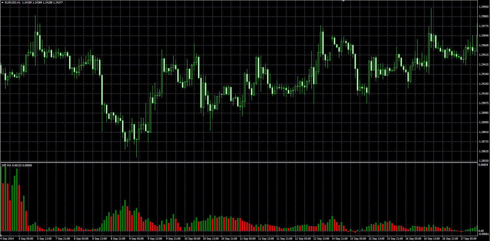

# Diff MA indicator

> Source: https://fxcodebase.com/code/viewtopic.php?f=38&t=61548  
> Forum: 38 · Topic 61548 · 1 post(s)

---

## Diff MA indicator

**Alexander.Gettinger** · Wed Nov 26, 2014 3:19 pm

The indicator looks like simple moving average (MVA) with some difference.

UP line is a MVA for [Period] last up-closed bars (close>open) and DN line is a MVA for [Period] last down-closed bars (close<open).

 

Download:

 [DiffMA.mq4](files/97394/DiffMA.mq4)

Diff MA Histogram is a difference between UP and DN lines.

 

Download:

 [DiffMA_Histogram.mq4](files/97394/DiffMA_Histogram.mq4)
