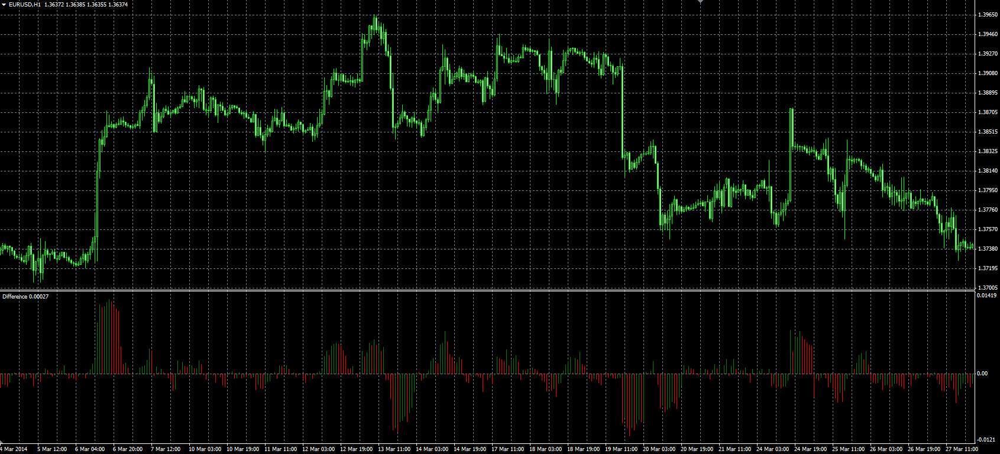

# Difference oscillator

> Source: https://fxcodebase.com/code/viewtopic.php?f=38&t=60799  
> Forum: 38 · Topic 60799 · 1 post(s)

---

## Difference oscillator

**Alexander.Gettinger** · Fri Jun 06, 2014 3:40 pm

Original LUA oscillator: [viewtopic.php?f=17&t=3925](https://fxcodebase.com/code/viewtopic.php?f=17&t=3925).

Formula:
Difference[i] = Price[i]-Price[i-Length], if Method=0 (Absolute),
Difference[i] = 100*(Price[i]-Price[i-Length])/Price[i-Length], if Method=1 (Relative).

 

Download:

 [Difference2.mq4](files/94379/Difference2.mq4)
