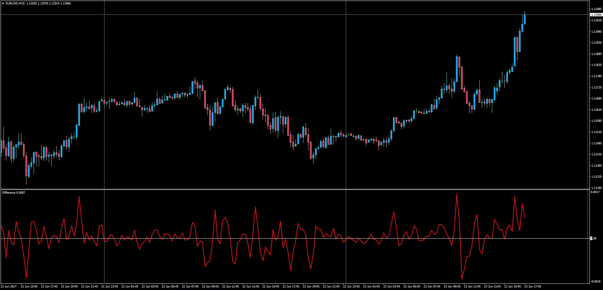

# Difference

> Source: https://fxcodebase.com/code/viewtopic.php?f=38&t=64838  
> Forum: 38 · Topic 64838 · 1 post(s)

---

## Difference

**Apprentice** · Sat Jun 24, 2017 3:43 am

LUA Original: [viewtopic.php?f=17&t=42662](https://fxcodebase.com/code/viewtopic.php?f=17&t=42662)

Description:

This simple MT4 version of the LUA original indicator will show the difference from the current period,and period N periods ago.

The value can be displayed in absolute value.

 [Difference.mq4](files/113096/Difference.mq4)
