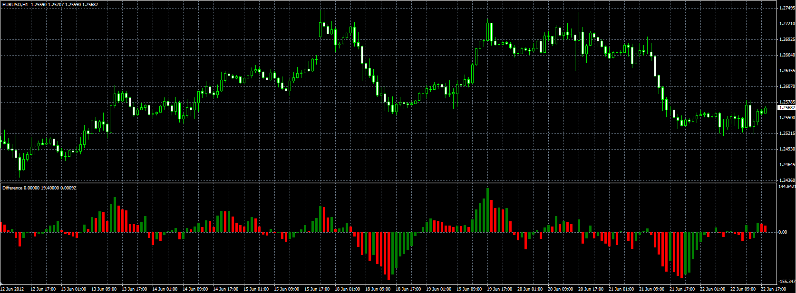

# Difference

> Source: https://fxcodebase.com/code/viewtopic.php?f=38&t=20490  
> Forum: 38 · Topic 20490 · 1 post(s)

---

## Difference

**Alexander.Gettinger** · Fri Jun 22, 2012 2:31 pm

Original indicator: [viewtopic.php?f=17&t=7174](https://fxcodebase.com/code/viewtopic.php?f=17&t=7174)

> The indicator calculates the moving average of difference between high and low, or, close and open.

If Method=0, indicator uses High/Low mode,
if Method=1, indicator uses Open/Close mode.

 

Download:

 [Difference.mq4](files/35915/Difference.mq4)
