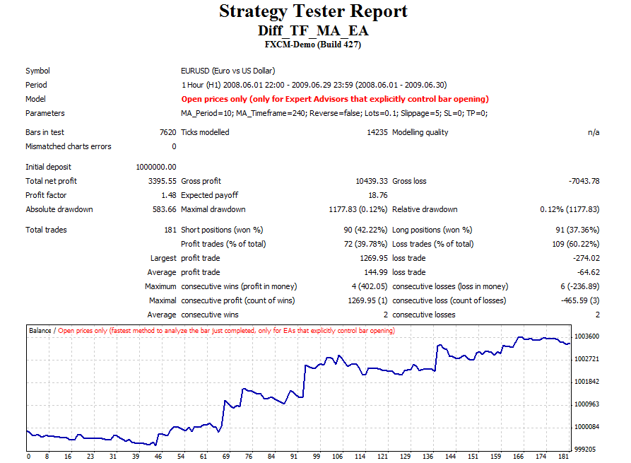

# Different TF moving averages EA

> Source: https://fxcodebase.com/code/viewtopic.php?f=38&t=19650  
> Forum: 38 · Topic 19650 · 1 post(s)

---

## Different TF moving averages EA

**Alexander.Gettinger** · Fri Jun 01, 2012 2:02 pm

Strategy based on Moving averages with different timeframes ([viewtopic.php?f=38&t=16421](https://fxcodebase.com/code/viewtopic.php?f=38&t=16421)).

 

Download:

 [Diff_TF_MA_EA.mq4](files/34746/Diff_TF_MA_EA.mq4)
