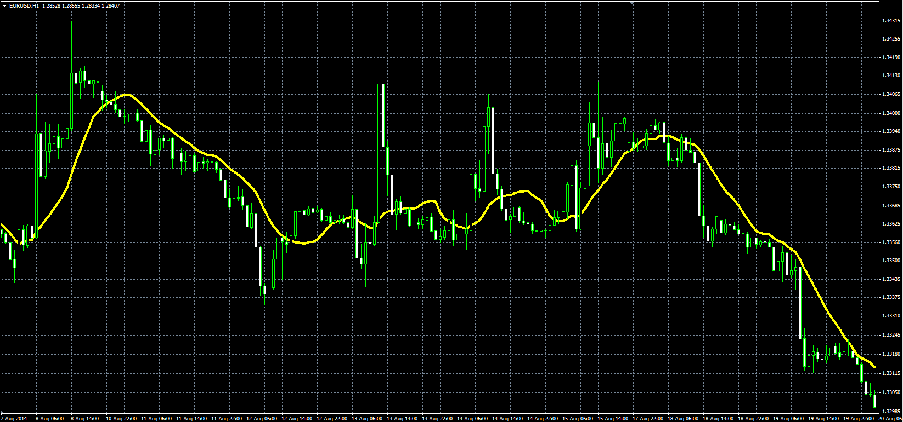

# Digital adaptive Moving Average (XMA)

> Source: https://fxcodebase.com/code/viewtopic.php?f=38&t=61221  
> Forum: 38 · Topic 61221 · 1 post(s)

---

## Digital adaptive Moving Average (XMA)

**Alexander.Gettinger** · Mon Sep 22, 2014 11:13 am

Original LUA indicator: [viewtopic.php?f=17&t=27877](https://fxcodebase.com/code/viewtopic.php?f=17&t=27877).

Formulas:
XMA[i] = MA[i], if Abs(MA[i]-MA[i-1])>=Step, else
XMA[i] = XMA[i-1], where
MA - moving average with [Length] number of periods and [Method] type,
Abs - absolute value.

 

Download:

 [XMA.mq4](files/96091/XMA.mq4)
