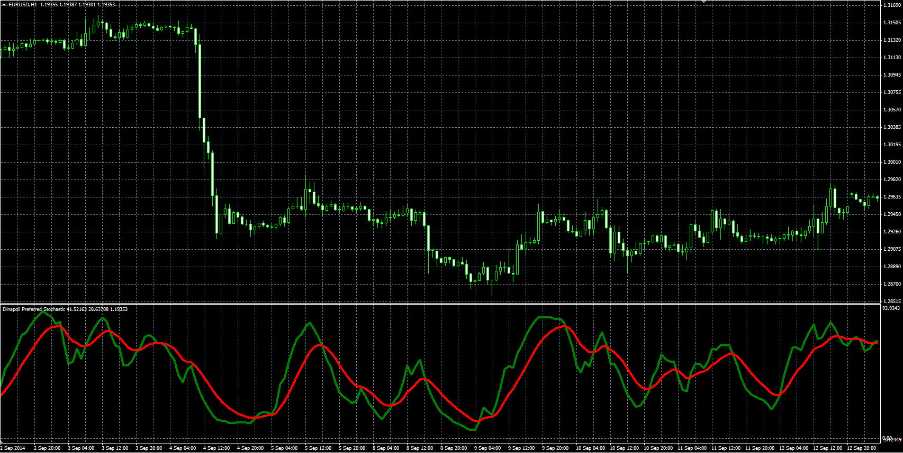

# Dinapoli Preferred Stochastic

> Source: https://fxcodebase.com/code/viewtopic.php?f=38&t=61691  
> Forum: 38 · Topic 61691 · 1 post(s)

---

## Dinapoli Preferred Stochastic

**Alexander.Gettinger** · Thu Jan 08, 2015 4:59 pm

Original LUA oscillator: [viewtopic.php?f=17&t=1874](https://fxcodebase.com/code/viewtopic.php?f=17&t=1874).

Formulas:
K[i] = K[i-1]+(FastK[i]-K[i-1])/D_Slowing,
D[i] = D[i-1]+(K[i]-D[i-1])/D_Length, where
FastK[i] = 100*(Close[i]-Min)/(Max-Min),
Max, Min - Maximum and minimum prices at range from (i-K_Length+1) to (i).

 

Download:

 [Dinapoli_Preferred_Stochastic.mq4](files/98053/Dinapoli_Preferred_Stochastic.mq4)

 [Dinapoli_Preferred_Stochastic_Bar.mq4](files/98053/Dinapoli_Preferred_Stochastic_Bar.mq4)
